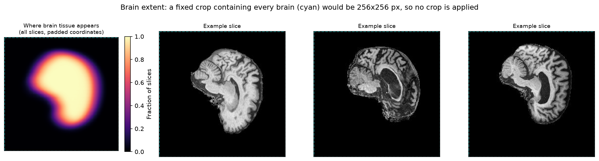
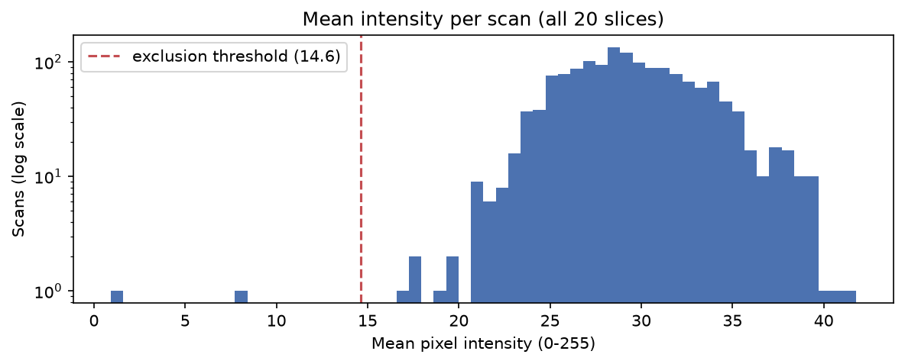
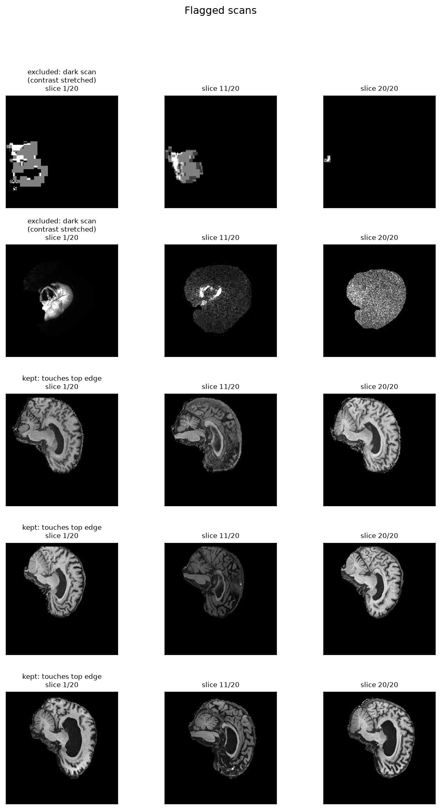
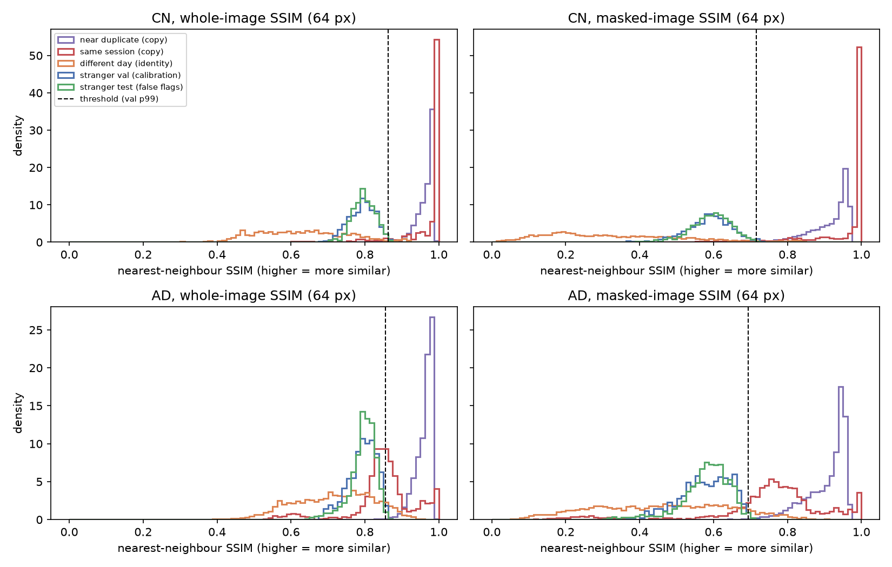

# StyleGAN2 for Synthetic ADNI Brain MRI Generation

Generating realistic, non-memorised brain MRI slices from the ADNI dataset with StyleGAN2, benchmarked against a WGAN-GP baseline.

> **Status:** Dataset audit and design phase. Sections marked *To be completed* will be filled in as the model is implemented and evaluated.

## Contents

1. [Overview](#1-overview)
2. [Feasibility Review](#2-feasibility-review)
3. [Dataset](#3-dataset)
4. [Dataset Discoveries and Fixes](#4-dataset-discoveries-and-fixes)
5. [Preprocessing and Data Splits](#5-preprocessing-and-data-splits)
6. [Design Decisions](#6-design-decisions)
7. [Memorisation Audit](#7-memorisation-audit)
8. [Reproducing the Dataset Audit](#8-reproducing-the-dataset-audit)
9. [Dependencies](#9-dependencies)
10. [Usage](#10-usage)
11. [Results](#11-results)
12. [Artificial Intelligence Usage Disclosure](#12-artificial-intelligence-usage-disclosure)
13. [References](#13-references)

---

## 1. Overview

Medical imaging research is constrained by patient privacy law and limited scan availability. Synthetic cohorts produced by generative models could be shared and used for augmentation, but only if they are anatomically plausible **and** do not reproduce real patients. This project trains StyleGAN2 on cognitively normal (CN) and Alzheimer's disease (AD) brain MRI slices from ADNI, compares it against a WGAN-GP baseline, and audits whether generated brains are genuinely novel or memorised copies of training patients.

*To be completed: how the algorithm works, with an architecture figure.*

## 2. Feasibility Review

*To be completed before the midpoint check-off.*

---

## 3. Dataset

### 3.1 Source

The preprocessed ADNI subset provided on the Rangpur cluster at `/home/groups/comp3710/ADNI`. It contains 2D JPEG slices only. The metadata JSON references NIfTI volumes and tissue segmentations, but those files are not included, so the JSON is used only for labels and patient identity.

### 3.2 Directory structure

```
/home/groups/comp3710/ADNI/
├── meta_data_with_label.json      # metadata for 2,189 ADNI scans
└── AD_NC/
    ├── train/
    │   ├── AD/                     # <scanID>_<sliceIndex>.jpeg
    │   └── NC/
    └── test/
        ├── AD/
        └── NC/
```

The folders use **NC** (normal control); ADNI and the metadata use **CN** (cognitively normal). They are the same group, and this project uses CN throughout.

### 3.3 Provided split

| Split | Class | Slices | Scans | Slices per scan |
|---|---|---:|---:|---:|
| train | AD | 10,400 | 520 | 20 |
| train | CN | 11,120 | 556 | 20 |
| test | AD | 4,460 | 223 | 20 |
| test | CN | 4,540 | 227 | 20 |
| **Total** | | **30,520** | **1,526** | |


### 3.4 Image properties

| Property | Value |
|---|---|
| Format | JPEG, 8-bit single-channel greyscale (PIL mode `L`) |
| Dimensions | 256 px wide × 240 px high (all 30,520 files) |
| Slices per scan | Exactly 20, always contiguous (slice index step of 1), for all 1,526 scans |
| Slice index range | 67–114 overall; each scan covers a different 20-slice window |
| Window start index | CN: median 88 (range 67–95); AD: median 78 (range 70–95) |
| Duplicates | None (no byte-identical files) |
| Background | 74% of pixels are near-black (intensity < 10) in both classes |
| File naming | `<scanID>_<sliceIndex>.jpeg`, where `scanID` is the ADNI image ID |
| View | Sagittal, skull-stripped (cerebellum, corpus callosum, and lateral ventricle visible) |
| Brain size | Median 167 H × 146 W px within the padded 256 × 256 frame; midline slices nearly fill the frame |
| Data quality | 2 corrupted scans (40 slices) excluded; 3 scans whose brains touch the top edge are kept (Discoveries 11–12) |




### 3.5 Metadata JSON

`meta_data_with_label.json` maps each ADNI image ID (the `scanID` in filenames) to file paths and a diagnostic label.

| Field | Contents |
|---|---|
| `raw` | Path to the original T1-weighted MPRAGE volume. The filename embeds the patient ID (`ADNI_XXX_S_XXXX`) |
| `masked` | Path to a masked, N4 bias-corrected volume (per the filename) |
| `c1`–`c5` | Paths to binarised SPM tissue segmentations |
| `label` | Diagnosis: 0 = CN, 1 = MCI, 2 = AD |

| Label | Diagnosis | JSON entries | In this dataset |
|---:|---|---:|---:|
| 0 | CN | 810 | 783 scans |
| 1 | MCI | 625 | 0 (excluded) |
| 2 | AD | 754 | 743 scans |

All 1,526 scans in the folders have a JSON entry, and every folder label agrees with its JSON label.

### 3.6 Patient-level structure

The 1,526 scans come from **680 patients**, many of whom were scanned at multiple visits.

| Class | Patients | Scans | Scans per patient |
|---|---:|---:|---:|
| CN | 459 | 783 | 1.71 |
| AD | 221 | 743 | 3.36 |
| **Total** | **680** | **1,526** | 2.24 |

| Scans per patient | 1 | 2 | 3 | 4 | 5 | 6 | 7 | 8 |
|---|---:|---:|---:|---:|---:|---:|---:|---:|
| Patients | 282 | 214 | 67 | 40 | 37 | 18 | 14 | 8 |

No patient changes diagnosis between visits: every patient is either CN-only or AD-only.


---

## 4. Dataset Discoveries and Fixes

| # | Discovery | Evidence | Impact | Fix |
|---|---|---|---|---|
| 1 | Filename IDs identify **scans, not patients** | JSON keys match the `I<ID>` suffix of ADNI image paths; 1,526 scan IDs map to 680 patients | Splitting by filename ID keeps a patient's other visits on both sides of the split | Extract the patient ID from the JSON `raw` path and split by patient |
| 2 | The provided train/test split **leaks patients** | 216 of 680 patients (32%) have scans in both train and test; 216 of the 331 test patients (65%) also appear in training | Held-out comparisons (FID, memorisation audit) would be contaminated by patients the model has seen | Discard the provided split and re-split at patient level (Section 5.2) |
| 3 | MCI scans are excluded | JSON contains 625 MCI entries; none appear in the folders | None for this task; the problem is CN vs AD only | Use only labels 0 and 2 |
| 4 | No diagnostic conversions | 459 CN-only and 221 AD-only patients | Each patient has one unambiguous class | Stratify the split by patient label |
| 5 | AD patients have about twice as many visits | 3.36 vs 1.71 scans per patient | Slice-level class balance shifts after re-splitting, and AD contributes most of the same-patient pairs in the memorisation audit | Report every split statistic and every audit threshold and rate per class |
| 6 | Images are not square | 256 wide × 240 high | StyleGAN2 requires square power-of-two resolutions | Zero-pad the height to 256 (8 rows top and bottom) |
| 7 | Slice windows differ between scans | Each scan has 20 contiguous slices, but window start positions vary across scans | The same slice index shows different anatomy in different scans | Memorisation comparisons use nearest-neighbour search over slices rather than matched indices |
| 8 | Background dominates every image | 74% of pixels are near-black (< 10) in both classes | Pixel metrics such as SSIM are inflated by shared black background, making any two brains look similar | Masked SSIM is the primary audit metric: at the same false-flag rate it detects 80% of AD same-session repeat scans, against 48% for whole-image SSIM (Section 7.3) |
| 9 | Slice windows are **class-dependent** | AD windows start at a median slice index of 78; CN windows at 88 | Class is confounded with anatomical level: a class-conditional model could learn "which part of the brain" rather than disease-related anatomy, and CN vs AD comparisons partly compare different brain regions | Compare classes at matched slice positions where possible, and account for the offset when interpreting conditional generation and per-class metrics |
| 10 | The brain already fills most of the frame | Median brain box 167 H × 146 W px in the padded 256 × 256 image; between the 0.1th and 99.9th percentiles, brain boxes span rows 8–228 and columns 14–239 | A fixed crop (which must contain every brain, so that brain size and position are not altered per image) would be the full frame and gain no resolution | No crop: padding only (`ADNI_CROP = None`) |
| 11 | Two scans are corrupted | Per-scan mean intensity of 0.9 and 7.8, against a median of 29.2 and a 1st percentile of 21.2. With contrast stretched, one is blocky noise; the other mixes a non-skull-stripped head with pure-noise slices. The first also accounts for all 3 empty slices and the only left-edge contact | A GAN would learn near-black or noise images as valid brains | Exclude scans with mean intensity < 0.5 × the median scan mean (14.6), applied after the patient split so no split assignment changes. Removes 2 scans (40 slices) belonging to 2 CN training patients with no other scans |
| 12 | Three scans' brains touch the top edge | 45 slices from 3 scans reach original row 0 | Visual inspection shows complete, anatomically normal brains positioned high in the frame | Kept |
| 13 | Some patients have **same-day repeat scans** | Acquisition dates and series IDs parsed from the metadata `raw` path (1,226 of 1,226 training scans). Training contains 253 same-day scan pairs (81 CN, 172 AD). CN same-day pairs have a median masked pair SSIM of 0.992 (58% above 0.99); no pair from different days exceeds 0.99 | A "same-person" memorisation threshold is pushed to about 1.0, so only pixel-perfect copies would be flagged. Repeat scans also count a patient's anatomy twice in training | Same-day pairs become a copy reference in the audit instead of setting the threshold (Section 7) |
| 14 | Visits on different days are **not aligned** | Different-day pairs share all 20 slice indices, yet each slice's best match is a median of 4 slices away and the median masked pair SSIM is 0.29–0.32 at every gap (under 6 months to over 2 years) | The same patient's other visit looks less similar than the nearest stranger among 24,520 training slices, so pixel SSIM cannot recognise a patient across visits | Threshold calibrated on validation strangers; different-day pairs reported as an identity reference and a stated limitation (Section 7) |

No byte-identical duplicate images exist across the 30,520 files.
**Open observations.** AD same-day pairs are a mixture: a few near-identical repeats, but most have a pair SSIM around 0.75–0.8, with a thin tail down to 0.2–0.5. Different acquisition protocols on the same day are a plausible cause, to be checked against the series descriptions. Two AD scan pairs share a series ID yet have a pair SSIM of only 0.36, which is not yet explained.






---

## 5. Preprocessing and Data Splits

### 5.1 Preprocessing pipeline

1. **Index:** record each slice's scan ID, slice index, position within its 20-slice window, and class. Attach the patient ID from the metadata JSON at runtime.
2. **Split:** assign every patient to train, validation, or test using all scans (Section 5.2). All slices of a patient's scans inherit that patient's split.
3. **Exclude corrupted scans:** drop scans whose mean intensity is below 0.5 × the median scan mean (Discovery 11). This happens after splitting, so it never changes any patient's split assignment.
4. **Pad:** zero-pad each 240 × 256 slice to 256 × 256 (8 rows top and bottom). Zero matches the existing background and preserves the anatomy's aspect ratio, which resizing directly would distort.
5. **No crop:** a fixed crop containing every brain would be the full frame (Discovery 10).
6. **Resize:** downsample with antialiasing to the working resolution: 64 × 64 during development, then 128 × 128 and 256 × 256.
7. **Scale:** map intensities from [0, 255] to [−1, 1], matching the generator's `tanh` output range.
8. **Preload:** hold all slices in memory as `uint8` and convert to float per batch, with an on-disk cache outside the repository. At 64 × 64 the training split occupies 100 MB, and the first load takes about 20 s with 8 workers.

Data augmentation is not yet decided. It will be introduced with adaptive discriminator augmentation (ADA) in a later iteration.


### 5.2 Split strategy

| Split | Share of patients | Purpose |
|---|---:|---|
| train | 80% (~544 patients) | Training StyleGAN2 and the WGAN-GP baseline |
| validation | 10% (~68 patients) | FID tracking and checkpoint selection during training |
| test | 10% (~68 patients) | Final FID and the memorisation audit's held-out comparisons |

**Why re-split rather than use the provided split:** the provided split places 216 patients on both sides (Discovery 2). For a generative model, a clean held-out set is what makes the memorisation audit meaningful: if held-out patients were seen in training, similarity between generated and held-out images proves nothing.

**Why patient-level and stratified:** all visits of a patient stay in one split, and stratifying by patient label keeps the CN:AD patient ratio equal across splits. The split is generated deterministically from a fixed seed.

**Why no split file is committed:** ADNI's data use agreement restricts redistribution, so patient identifiers are kept out of this public repository. The split is regenerated from the seed at runtime.

Resulting split (seed 42), verified by the `dataset.py` smoke test, which also asserts that no patient or scan appears in more than one split:

| Split | Patients (CN / AD) | Scans (CN / AD) | Slices (CN / AD) | AD share of slices |
|---|---:|---:|---:|---:|
| train | 365 / 177 | 622 / 604 | 12,440 / 12,080 | 49.3% |
| val | 46 / 22 | 72 / 71 | 1,440 / 1,420 | 49.7% |
| test | 46 / 22 | 87 / 68 | 1,740 / 1,360 | 43.9% |
| **Total** | **678** | **1,524** | **30,480** | |

Both excluded scans (Discovery 11) belonged to CN patients in the training split who had no other scans, so train holds 365 CN patients rather than the 367 assigned. Validation and test are unaffected.

Stratification balances patients, not slices. Because AD patients have between 1 and 8 scans each, the slice-level class balance varies between splits (the test split has fewer AD scans), so all evaluation metrics are reported per class rather than pooled.

---

## 6. Design Decisions

| Decision | Choice | Rationale |
|---|---|---|
| Model | StyleGAN2 | Style-based generation gives a disentangled latent space (W) that supports interpolation, PCA-based analysis, and projection of real scans for the memorisation audit |
| Baseline | WGAN-GP | Previously implemented and validated on OASIS brain slices; retrained on the same ADNI split for a like-for-like comparison |
| Verification dataset | OASIS brain slices at 64 × 64 | A known-good WGAN-GP result exists at this setting, so a new StyleGAN2 implementation that underperforms it indicates a bug |
| Resolution schedule | 64 → 128 → 256 | Fast iteration at low resolution; scale up only once training is stable |
| Split | Patient-level, label-stratified, 80/10/10, fixed seed | Removes the leakage in the provided split (Section 4) |
| Privacy | No patient IDs or split files committed | ADNI data use terms |
| Memorisation audit | Nearest-neighbour masked SSIM to the training set, with per-class thresholds calibrated on validation patients and checked on test patients | Calibrated on real data instead of an arbitrary cutoff; the originally planned same-person threshold proved invalid (Section 7.1) |
| Code organisation | `modules.py`, `dataset.py`, `train.py`, `predict.py`, plus `audit.py` and `data_audit.py` | Required structure; model code depends only on PyTorch |
| Brain crop | None (padding only) | Measured: a crop containing every brain is the full frame (Discovery 10) |
| Scan quality filter | Exclude scans with mean intensity < 0.5 × median, after the patient split | Removes the two corrupted scans with a relative rule rather than hard-coded IDs, without altering the split (Discovery 11) |

---

## 7. Memorisation Audit

**Question:** is a generated brain a new brain, or a copy of a training image?

Each generated slice is compared with its nearest neighbour in the training set. The decision threshold is calibrated on real data rather than chosen arbitrarily. Validation patients were never seen in training, so their slices show how close a genuinely new brain gets to the training set by chance. A generated slice closer to a training slice than 99% of new real brains get is flagged and inspected side by side with its neighbour. Every rung except the generated one uses real data only, so the audit is calibrated before any model is trained (`audit.py`).

### 7.1 From the original design to the current one

The original design took the threshold from repeat visits of the same patient. The first calibration run showed that this fails, and a visit-pair diagnostic that dates each scan from its metadata path explained why (Discoveries 13 and 14):

- **Same-day repeat scans are near-identical** (CN median pair SSIM 0.992). They pushed the 95th-percentile same-person threshold to 0.9995 for CN, so a generator would have to copy almost pixel-perfectly to be flagged.
- **Visits on different days are not aligned.** A patient's other visit scores lower (median masked SSIM 0.30) than the nearest stranger among 24,520 training slices (median 0.59), so pixel SSIM does not recognise a patient across visits.

Same-day and different-day pairs are therefore kept as reference rungs, and the threshold now comes from strangers.

### 7.2 Similarity ladder

| Rung | Comparison | Role |
|---|---|---|
| Near-duplicate | Adjacent slices of the same training scan | Copy reference: a copy displaced by one slice should be flagged |
| Same session | Training slice → nearest slice of another scan of the same patient acquired on the same day | Copy reference: a repeat acquisition should be flagged |
| Different day | Training slice → nearest slice of the same patient's scans from other days | Identity reference: does the metric recognise a patient across visits? |
| Stranger (val) | Validation slice → nearest training slice | **Calibration:** threshold = 99th percentile, per class and metric |
| Stranger (test) | Test slice → nearest training slice | False-flag check on patients not used for calibration |
| Generated | Generated slice → nearest training slice | Under evaluation |

### 7.3 Results at 64 × 64

All 2,860 validation and 3,100 test slices were searched against all 24,520 training slices. The table shows the share of each rung at or above the class threshold:

| Rung | Role | CN whole | CN masked | AD whole | AD masked |
|---|---|---:|---:|---:|---:|
| Near-duplicate | copy | 99.6% | 99.2% | 99.7% | 99.5% |
| Same session | copy | 92.3% | 93.9% | 47.6% | 80.2% |
| Different day | identity | 3.8% | 4.0% | 9.0% | 10.7% |
| Stranger (val) | calibration | 1.0% | 1.0% | 1.1% | 1.1% |
| Stranger (test) | false flags | 0.7% | 0.3% | 0.9% | 0.6% |
| **Threshold (SSIM)** | | 0.863 | 0.716 | 0.856 | 0.694 |



*Nearest-neighbour SSIM to the training set at 64 px. The threshold (dashed) is the 99th percentile of validation strangers. Copy references (purple, red) fall above it and test strangers (green) below it; different-day visits of the same patient (orange) mostly fall below it.*

**Findings:**

1. **The calibration transfers to unseen patients.** Test strangers are flagged at 0.3–0.9%, matching the nominal 1%. A generator producing genuinely new brains should therefore see about 1% of its samples flagged; a clearly higher rate is evidence of copying.
2. **The audit catches copies.** At least 99.2% of near-duplicates are flagged, even though the anatomy shifts by one slice, as are 92–94% of CN same-day repeats.
3. **Masked SSIM is the primary metric.** At the same false-flag rate, it flags 80% of AD same-session pairs against 48% for whole-image SSIM, because shared background hides real differences (Discovery 8).
4. **Limitation: the audit barely sees identity.** Only 4% (CN) and 11% (AD) of different-day slices are flagged. That is above the 1% stranger rate, so some identity signal exists, but a generator that reproduces a training patient's anatomy in a new head position would mostly pass. A feature-space check is planned: whether Inception features find a patient's other visit more often than chance.
5. **Limitation: SSIM neighbours carry little class information.** The nearest training slice shares the test slice's class 59–61% of the time for CN and 51.5% for AD, against 50.7% CN among training slices. SSIM audits copying, not whether generated AD brains look like AD.

### 7.4 Implementation details

- **SSIM** follows Wang et al. (2004): 11 × 11 Gaussian window (σ = 1.5), K₁ = 0.01, K₂ = 0.03, data range 1, computed with valid convolution so borders never mix with padding. It agrees with scikit-image's `structural_similarity` to within 5 × 10⁻⁶ on test images.
- **Masked SSIM** averages the SSIM map over the union of both images' brain pixels (intensity > 10). Background that is black in both images is ignored, but brain present in only one image still counts against the pair.
- **Nearest-neighbour search everywhere**, because slice windows differ between scans and generated slices have no known position (Discovery 7). Each metric picks its own nearest neighbour. Per-image statistics are computed once, so each comparison only adds the cross term, run as batched GPU operations in PyTorch.
- **Per-class thresholds.** The masked thresholds for CN (0.716) and AD (0.694) are close, so an unconditional generator can be audited against a pooled threshold.
- **Resolution-specific.** These thresholds hold at 64 × 64 only and are recomputed at each training resolution.
- **Cost:** 77 queries per second against 24,520 training slices, 6.0 GB peak GPU memory, about 1.5 minutes for the full run on one A100.
- **Caveats.** The 99th percentile rests on about 14 slices per class from 68 validation patients, and slices from one patient are correlated; a patient-level bootstrap of the threshold is the next refinement if a generator's flag rate lands near 1%. Acquisition dates come from the timestamp in the metadata `raw` path, which behaves as an acquisition date: no pair from different days exceeds an SSIM of 0.99.

### 7.5 Reproducing the audit

```bash
sbatch audit.sh                      # full run, about 1.5 min on one A100
sbatch audit.sh --max_queries 500    # quick run with subsampled stranger queries
```

Results are written to `outputs/audit/` (gitignored; local split indices only, no patient IDs) and the figure to `figures/audit_ladder_r64.png`.

**Rangpur notes.** Jobs on the `comp3710` partition must be charged to the `comp3710` account (`#SBATCH --account=comp3710`), because the partition only accepts that account and a student's default account differs. The nodes expose no schedulable memory, so `--mem` must be omitted; otherwise the job waits indefinitely with reason `PartitionConfig`. The course guide's example `job.sh` includes `--mem=16G`.

---

## 8. Reproducing the Dataset Audit

All statistics and figures in Sections 3 and 4 come from `data_audit.py`. On Rangpur:

```bash
srun --partition=cpu --time=00:45:00 --pty bash
conda activate torch
python data_audit.py            # prints statistics, writes figures/ next to the script
exit
```

The script prints only aggregate statistics and never writes patient IDs to disk.

---

## 9. Dependencies

*To be completed with exact versions.*

## 10. Usage

*To be completed.*

## 11. Results

*To be completed: baseline comparison, resource profiling, failure-case analysis, and recommendation.*

## 12. Artificial Intelligence Usage Disclosure

This disclosure follows the UQ Library *Guide to acknowledging and referencing AI*, which asks for the AI tool, how it was used, the prompts, the part of the work affected, and the date. A verification column is added as required by the COMP3710 report specification (Section 6.1). The log is updated as the project progresses.

### 12.1 Tools used

| Tool | Provider | Access |
|---|---|---|
| Claude Opus 5.5 | Anthropic | claude.ai web interface (project workspace) |

### 12.2 Usage log

| Date | AI tool | How it was used | Prompt(s) (summarised or quoted) | Part of the work | How I verified it |
|---|---|---|---|---|---|
| 28/09/2026 | Claude Opus 5.5 | **Planned / brainstormed:** compared the Hard-difficulty projects against my previous lab work; I chose StyleGAN2 on ADNI | "Give me my best options, hard difficulty only…"; "how about style GAN? … would it connect with what i've done in the assessments?" | Project choice; Sections 1 and 6 | Checked each option's difficulty band, dataset, and targets against Section 2 of the report specification |
| 28/09/2026 | Claude Opus 5.5 | **Instructions:** step-by-step guidance for forking the repository, the folder skeleton, `.gitignore`, and GitHub SSH access from Rangpur | "maybe we should fork the repo first and setup the vs code environment first?"; "lets do the ssh stuff now with rangpur" | Repository structure, `.gitignore`, Git workflow | Confirmed the `topic-recognition` branch and project folder on GitHub; `ssh -T git@github.com` authenticated successfully; verified GitHub's host key fingerprint against GitHub's published value |
| 28/09/2026 | Claude Opus 5.5 | **Generated code:** shell and Python one-off commands to explore the ADNI folder structure, filename convention, metadata JSON, and patient-level overlap | Requests to inspect the ADNI dataset on Rangpur | Sections 3 and 4 (dataset structure, Discoveries 1–7) | Ran every command myself on Rangpur and reviewed the raw output; checked internal consistency (e.g. scans per patient sums to 680 patients and 1,526 scans) |
| 28/09/2026 | Claude Opus 5.5 | **Brainstormed / planned:** proposed the patient-level re-split and the memorisation threshold calibrated from repeat visits of the same patient (distance ladder); I adopted both | "For the design, I like the measure of how similar two scans of the same person across visits can be used as a principled memorisation threshold, can we include that in the design too?" | Sections 5.2 and 7 | Reasoned through each design choice against the leakage evidence in Section 4; implementation and validation still to come |
| 28/09/2026 | Claude Opus 5.5 | **Generated code:** wrote `data_audit.py` (dataset checks and README figures) | "lets update the readme, have to document the preprocessing steps … could be good to have some graphs generated at this stage too" | `data_audit.py`; `figures/`; Section 8 | Ran it on the full dataset on Rangpur; its statistics matched my earlier independent command outputs (e.g. 216 overlapping patients, 1,526 scans); inspected the generated figures |
| 28/09/2026 | Claude Opus 5.5 | **Drafted / edited:** drafted README Sections 3–8 from my audit results, then updated them with the full audit output (including Discovery 9) | Same as above, plus pasting the `data_audit.py` output | README Sections 3–8 | Checked every number in the README against the Rangpur output |
| 28/09/2026 | Claude Opus 5.5 | **Drafted:** this disclosure table, following UQ Library guidance located via web search | "can you add an AI usage referencing table to the readme in accordance with uq guidelines?? include the date - 28/09/2026" | Section 12 | Checked the required fields against the UQ Library guide linked below |
| 28/09/2026 | Claude Opus 5.5 | **Edited:** changed the AI reference in 12.4 to UQ's general APA format with the tool's web address, and added it to the reference list | "yes add the tool's web address to those references" | Sections 12.4 and 13 | Checked the format against the APA 7th "General AI references" example in the UQ Library guide |
| 28/09/2026 | Claude Opus 5.5 | **Planned:** ordered the next stages (data pipeline → threshold calibration → WGAN-GP baseline → feasibility review → StyleGAN2) | "ok all done, git is up to date. Where to next?" | Project plan; Section 2 (feasibility review) | Checked the plan against the feasibility check-off requirements in Section 3 of the report specification |
| 28/09/2026 | Claude Opus 5.5 | **Generated code:** wrote `dataset.py` (slice indexing, patient-level stratified split, padding/resizing, cached preloading, OASIS verification loader, smoke test) | "yes" (in response to the proposal to write `dataset.py` with the index, patient-level split, and preloading) | `dataset.py`; Sections 5.1 and 5.2 | Indexing and split logic were tested on synthetic data (correct 544/68/68 patient split, deterministic across runs). Ran the smoke test on Rangpur: the leakage assertion passed, the split table matched the designed patient counts (544/68/68), and the real-image grids in `figures/dataset_batch_check.png` and `figures/oasis_batch_check.png` showed correctly preprocessed brain slices |
| 05/10/2026 | Claude Opus 5.5 | **Generated code / analysed:** proposed cropping to the brain region and wrote the brain-extent measurement and crop support in `data_audit.py` and `dataset.py` | "yes" (in response to the proposal to crop to the brain region) | `data_audit.py`; `dataset.py` (`ADNI_CROP`); Discovery 10 | Ran the measurement on Rangpur. Claude's visual estimate of brain size from the batch grid (about 40% of the frame) was wrong; the measurement showed about 65% and a full-frame crop, so I rejected cropping based on the evidence |
| 05/10/2026 | Claude Opus 5.5 | **Generated code:** one-off diagnostic scripts to locate outlier slices, per-scan intensity, edge-touching scans, and the second-darkest scan, plus `scp` commands to retrieve figures | Requests to run and retrieve the diagnostics (e.g. "give me the scp cmds") | Discoveries 11–12 | Inspected every diagnostic figure myself: two scans are corrupted, three edge-touching scans are anatomically normal |
| 05/10/2026 | Claude Opus 5.5 | **Generated code:** relative-intensity exclusion rule applied after the patient split in `dataset.py`; folded the diagnostics into `data_audit.py` | Continuation of the outlier investigation, after I uploaded the figures and output | `dataset.py`; `data_audit.py`; Section 5.1 | Full audit on Rangpur flagged exactly the 2 corrupted scans; smoke test passed the leakage check, removed 2 scans (40 slices) from train only, and left val and test unchanged |
| 05/10/2026 | Claude Opus 5.5 | **Drafted:** README updates for Discoveries 10–12 and Sections 3.4, 5.1, 5.2, 6, and 8 | Pasting the audit and smoke-test output | README Sections 3–6, 8 | Checked every number against the Rangpur output |
| 05/10/2026 | Claude Opus 5.5 | **Generated code:** wrote `audit.py` part 1 (batched GPU SSIM, near-duplicate, same-person and different-person rungs, per-class thresholds) and the Slurm script `audit.sh` | \"let me give you access to the repo … Read dataset.py from my fork\" | `audit.py`, `audit.sh`; Section 7 | Claude checked its SSIM against scikit-image (agreement within 5 × 10⁻⁶) and the chunked search against brute force on synthetic data; I reviewed the code and ran it on ADNI on Rangpur (job 632476) |
| 05/10/2026 | Claude Opus 5.5 | **Debugged:** diagnosed why the job sat in `PartitionConfig`. Claude's first `audit.sh` copied `--mem` from the course guide and omitted `--account`, and its `source activate` line received the script's arguments | Pasted `squeue`, `scontrol show partition`, `scontrol show job` and `sacctmgr` output | `audit.sh`; Section 7.5 | Confirmed with `scontrol` (partition memory 10M in total, `AllowAccounts=comp3710`, job charged to my personal account) and `sacctmgr`; the corrected job ran with an empty error log |
| 06/10/2026 | Claude Opus 5.5 | **Analysed / generated code:** Claude pointed out that the first run's same-person threshold (~1.0) was invalid (the design it had proposed on 28/09), hypothesised duplicate acquisitions, and wrote a visit-pair diagnostic dating each scan from its metadata path | Pasted the first `audit.py` output and the structure of a metadata `raw` path (patient ID masked) | `audit.py`; Discoveries 13–14 | Ran the diagnostic on Rangpur (job 634430): near-identical pairs occur only on the same day, and different-day visits are misaligned (median best-match offset 4 slices) |
| 06/10/2026 | Claude Opus 5.5 | **Generated code:** restructured the audit around validation-calibrated stranger thresholds, with same-session and different-day pairs as reference rungs. I asked whether this was worthwhile before agreeing. Committed as `0c93c41`, which by mistake reuses the previous commit's message | \"do you think it is worthwhile restructuring the threshold? if that will give us better findings and a better stylegan ultimately, i think we should.\" | `audit.py`; Section 7 | Claude tested it on synthetic patients with planted copies; I ran it on ADNI (job 634470): test false-flag rate 0.3–0.9% against the nominal 1%, and at least 99.2% of near-duplicates flagged |
| 06/10/2026 | Claude Opus 5.5 | **Drafted:** README updates for Discoveries 5, 8, 13 and 14 and Sections 6 and 7, plus these log rows | \"yes, lets do it\" (after uploading the audit figure) | README Sections 4, 6, 7 and 12 | Checked every number against the output of jobs 632476, 634430 and 634470 |

### 12.3 Verification approach

AI-generated commands and code were never trusted on their own output alone. Every statistic reported here comes from commands I ran on Rangpur, and counts were cross-checked between independent methods (one-off shell commands and `data_audit.py`). Design suggestions were adopted only after I checked them against the dataset evidence. I take full responsibility for all code, analysis, and claims in this project.

### 12.4 Reference (APA 7th)

Anthropic. (2026). *Claude* [Large language model]. https://claude.ai

Guidance followed: The University of Queensland Library. *Guide to acknowledging and referencing AI.* https://guides.library.uq.edu.au/referencing/acknowledging-and-referencing-ai

## 13. References

- T. Karras, S. Laine, and T. Aila, "A style-based generator architecture for generative adversarial networks," CVPR, 2019.
- T. Karras et al., "Analyzing and improving the image quality of StyleGAN," CVPR, 2020.
- I. Gulrajani et al., "Improved training of Wasserstein GANs," NeurIPS, 2017.
- S. Liu, S. Chandra, et al., "Style-based generative models for medical neuroimaging," IEEE Transactions on Medical Imaging, 2023.
- Alzheimer's Disease Neuroimaging Initiative (ADNI), http://adni.loni.usc.edu
- Anthropic. (2026). *Claude* [Large language model]. https://claude.ai
- Z. Wang, A. C. Bovik, H. R. Sheikh, and E. P. Simoncelli, "Image quality assessment: from error visibility to structural similarity," IEEE Transactions on Image Processing, vol. 13, no. 4, pp. 600–612, 2004.