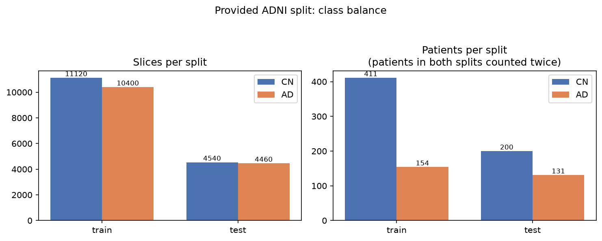
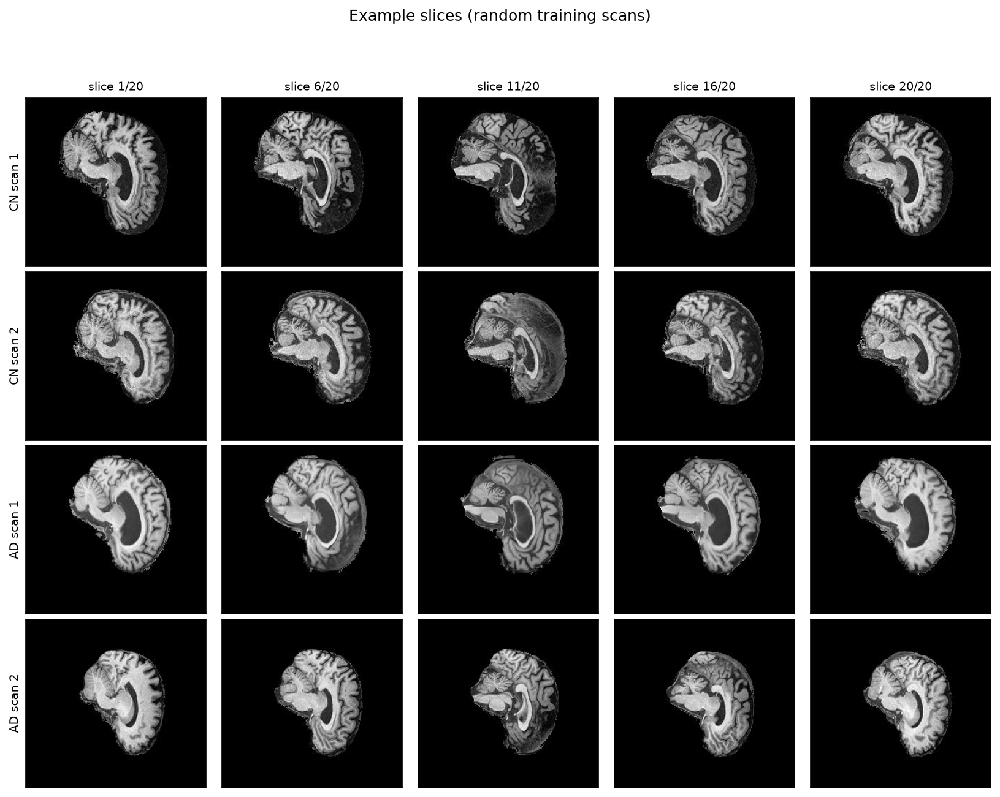
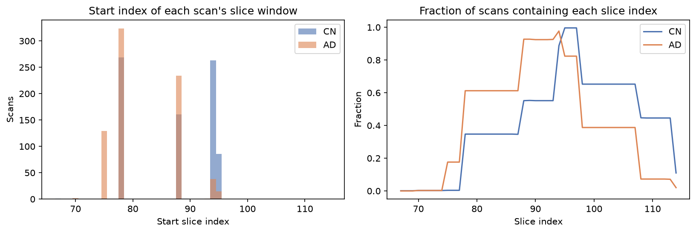
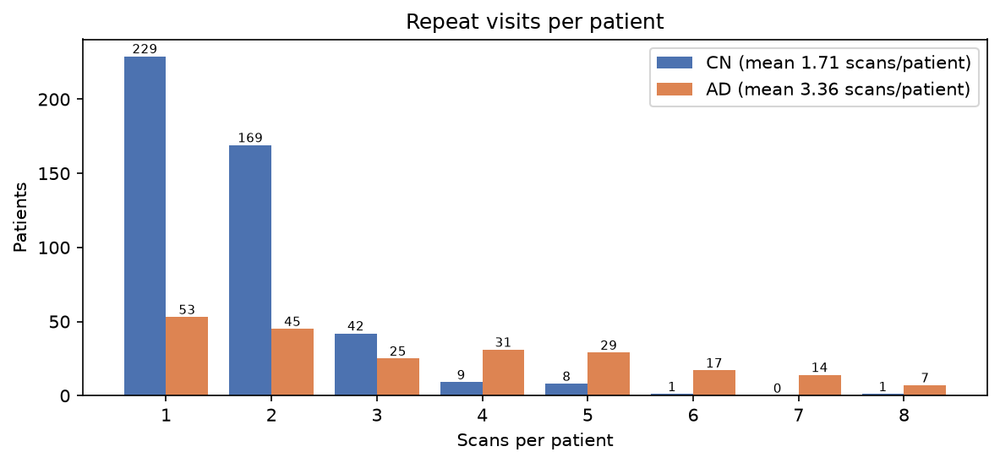
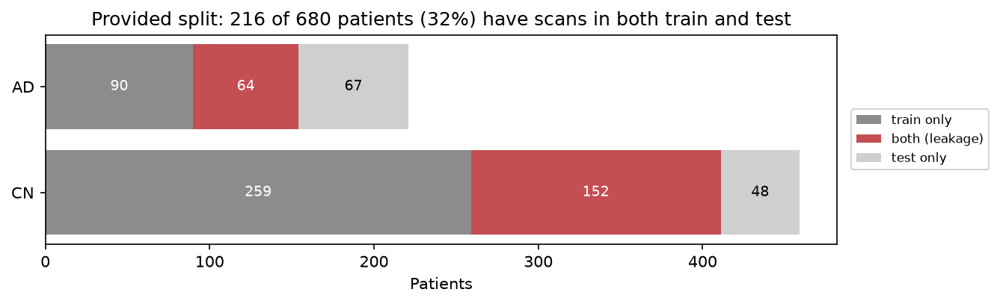
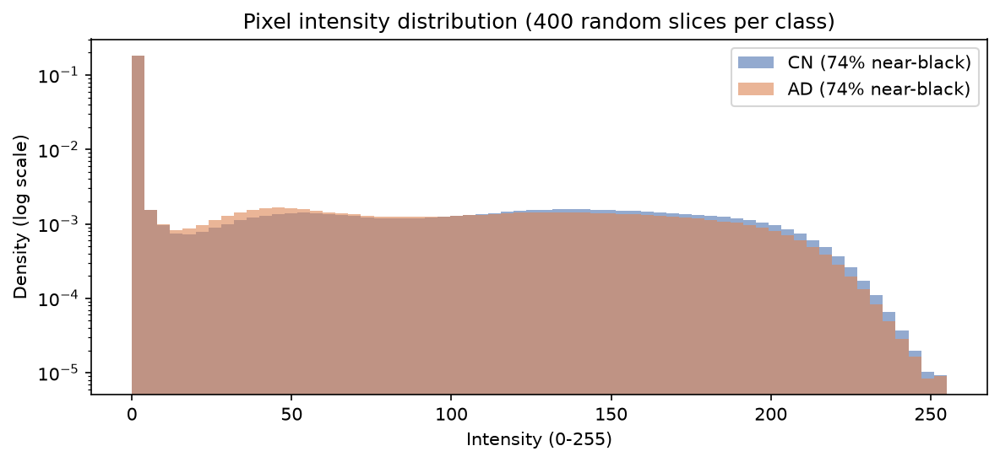
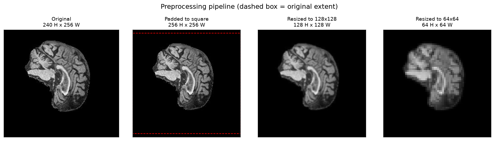

# StyleGAN2 for Synthetic ADNI Brain MRI Generation

Generating realistic, non-memorised brain MRI slices from the ADNI dataset with StyleGAN2, benchmarked against a WGAN-GP baseline.

> **Status:** Dataset audit and design phase. Sections marked *To be completed* will be filled in as the model is implemented and evaluated.

## Contents

1. [Overview](#1-overview)
2. [Feasibility Review](#2-feasibility-review)
3. [Dataset](#3-dataset)
4. [Dataset Discoveries and Fixes](#4-dataset-discoveries-and-fixes)
5. [Preprocessing and Data Splits](#5-preprocessing-and-data-splits)
6. [Design Decisions](#6-design-decisions)
7. [Memorisation Audit Design](#7-memorisation-audit-design)
8. [Reproducing the Dataset Audit](#8-reproducing-the-dataset-audit)
9. [Dependencies](#9-dependencies)
10. [Usage](#10-usage)
11. [Results](#11-results)
12. [Artificial Intelligence Usage Disclosure](#12-artificial-intelligence-usage-disclosure)
13. [References](#13-references)

---

## 1. Overview

Medical imaging research is constrained by patient privacy law and limited scan availability. Synthetic cohorts produced by generative models could be shared and used for augmentation, but only if they are anatomically plausible **and** do not reproduce real patients. This project trains StyleGAN2 on cognitively normal (CN) and Alzheimer's disease (AD) brain MRI slices from ADNI, compares it against a WGAN-GP baseline, and audits whether generated brains are genuinely novel or memorised copies of training patients.

*To be completed: how the algorithm works, with an architecture figure.*

## 2. Feasibility Review

*To be completed before the midpoint check-off.*

---

## 3. Dataset

### 3.1 Source

The preprocessed ADNI subset provided on the Rangpur cluster at `/home/groups/comp3710/ADNI`. It contains 2D JPEG slices only. The metadata JSON references NIfTI volumes and tissue segmentations, but those files are not included, so the JSON is used only for labels and patient identity.

### 3.2 Directory structure

```
/home/groups/comp3710/ADNI/
├── meta_data_with_label.json      # metadata for 2,189 ADNI scans
└── AD_NC/
    ├── train/
    │   ├── AD/                     # <scanID>_<sliceIndex>.jpeg
    │   └── NC/
    └── test/
        ├── AD/
        └── NC/
```

The folders use **NC** (normal control); ADNI and the metadata use **CN** (cognitively normal). They are the same group, and this project uses CN throughout.

### 3.3 Provided split

| Split | Class | Slices | Scans | Slices per scan |
|---|---|---:|---:|---:|
| train | AD | 10,400 | 520 | 20 |
| train | CN | 11,120 | 556 | 20 |
| test | AD | 4,460 | 223 | 20 |
| test | CN | 4,540 | 227 | 20 |
| **Total** | | **30,520** | **1,526** | |



### 3.4 Image properties

| Property | Value |
|---|---|
| Format | JPEG, 8-bit single-channel greyscale (PIL mode `L`) |
| Dimensions | 256 px wide × 240 px high (all 30,520 files) |
| Slices per scan | Exactly 20, always contiguous (slice index step of 1), for all 1,526 scans |
| Slice index range | 67–114 overall; each scan covers a different 20-slice window |
| Window start index | CN: median 88 (range 67–95); AD: median 78 (range 70–95) |
| Duplicates | None (no byte-identical files) |
| Background | 74% of pixels are near-black (intensity < 10) in both classes |
| File naming | `<scanID>_<sliceIndex>.jpeg`, where `scanID` is the ADNI image ID |





### 3.5 Metadata JSON

`meta_data_with_label.json` maps each ADNI image ID (the `scanID` in filenames) to file paths and a diagnostic label.

| Field | Contents |
|---|---|
| `raw` | Path to the original T1-weighted MPRAGE volume. The filename embeds the patient ID (`ADNI_XXX_S_XXXX`) |
| `masked` | Path to a masked, N4 bias-corrected volume (per the filename) |
| `c1`–`c5` | Paths to binarised SPM tissue segmentations |
| `label` | Diagnosis: 0 = CN, 1 = MCI, 2 = AD |

| Label | Diagnosis | JSON entries | In this dataset |
|---:|---|---:|---:|
| 0 | CN | 810 | 783 scans |
| 1 | MCI | 625 | 0 (excluded) |
| 2 | AD | 754 | 743 scans |

All 1,526 scans in the folders have a JSON entry, and every folder label agrees with its JSON label.

### 3.6 Patient-level structure

The 1,526 scans come from **680 patients**, many of whom were scanned at multiple visits.

| Class | Patients | Scans | Scans per patient |
|---|---:|---:|---:|
| CN | 459 | 783 | 1.71 |
| AD | 221 | 743 | 3.36 |
| **Total** | **680** | **1,526** | 2.24 |

| Scans per patient | 1 | 2 | 3 | 4 | 5 | 6 | 7 | 8 |
|---|---:|---:|---:|---:|---:|---:|---:|---:|
| Patients | 282 | 214 | 67 | 40 | 37 | 18 | 14 | 8 |

No patient changes diagnosis between visits: every patient is either CN-only or AD-only.



---

## 4. Dataset Discoveries and Fixes

| # | Discovery | Evidence | Impact | Fix |
|---|---|---|---|---|
| 1 | Filename IDs identify **scans, not patients** | JSON keys match the `I<ID>` suffix of ADNI image paths; 1,526 scan IDs map to 680 patients | Splitting by filename ID keeps a patient's other visits on both sides of the split | Extract the patient ID from the JSON `raw` path and split by patient |
| 2 | The provided train/test split **leaks patients** | 216 of 680 patients (32%) have scans in both train and test; 216 of the 331 test patients (65%) also appear in training | Held-out comparisons (FID, memorisation audit) would be contaminated by patients the model has seen | Discard the provided split and re-split at patient level (Section 5.2) |
| 3 | MCI scans are excluded | JSON contains 625 MCI entries; none appear in the folders | None for this task; the problem is CN vs AD only | Use only labels 0 and 2 |
| 4 | No diagnostic conversions | 459 CN-only and 221 AD-only patients | Each patient has one unambiguous class | Stratify the split by patient label |
| 5 | AD patients have about twice as many visits | 3.36 vs 1.71 scans per patient | A pooled memorisation threshold would be dominated by AD pairs; slice-level class balance will shift after re-splitting | Compute memorisation thresholds per class; report slice balance of the new split |
| 6 | Images are not square | 256 wide × 240 high | StyleGAN2 requires square power-of-two resolutions | Zero-pad the height to 256 (8 rows top and bottom) |
| 7 | Slice windows differ between scans | Each scan has 20 contiguous slices, but window start positions vary across scans | The same slice index shows different anatomy in different scans | Memorisation comparisons use nearest-neighbour search over slices rather than matched indices |
| 8 | Background dominates every image | 74% of pixels are near-black (< 10) in both classes | Pixel metrics such as SSIM are inflated by shared black background, making any two brains look similar | Evaluate whether SSIM should be computed within a brain mask (Section 7) |
| 9 | Slice windows are **class-dependent** | AD windows start at a median slice index of 78; CN windows at 88 | Class is confounded with anatomical level: a class-conditional model could learn "which part of the brain" rather than disease-related anatomy, and CN vs AD comparisons partly compare different brain regions | Compare classes at matched slice positions where possible, and account for the offset when interpreting conditional generation and per-class metrics |

No byte-identical duplicate images exist across the 30,520 files.





---

## 5. Preprocessing and Data Splits

### 5.1 Preprocessing pipeline

1. **Index:** scan the folders and record each slice's scan ID, slice index, and class. Attach the patient ID from the metadata JSON at runtime.
2. **Split:** assign every patient to train, validation, or test (Section 5.2). All slices of all scans from a patient inherit that patient's split.
3. **Pad:** zero-pad each 240 × 256 slice to 256 × 256 (8 rows top and bottom). Zero matches the existing background and preserves the anatomy's aspect ratio, which resizing directly would distort.
4. **Resize:** downsample with antialiasing to the working resolution: 64 × 64 during development, then 128 × 128 and 256 × 256.
5. **Scale:** map intensities from [0, 255] to [−1, 1], matching the generator's `tanh` output range.
6. **Preload:** hold all slices in memory as `uint8` and convert to float per batch. At 128 × 128 the full dataset is about 500 MB.

Data augmentation is not yet decided. It will be introduced with adaptive discriminator augmentation (ADA) in a later iteration.



### 5.2 Split strategy

| Split | Share of patients | Purpose |
|---|---:|---|
| train | 80% (~544 patients) | Training StyleGAN2 and the WGAN-GP baseline |
| validation | 10% (~68 patients) | FID tracking and checkpoint selection during training |
| test | 10% (~68 patients) | Final FID and the memorisation audit's held-out comparisons |

**Why re-split rather than use the provided split:** the provided split places 216 patients on both sides (Discovery 2). For a generative model, a clean held-out set is what makes the memorisation audit meaningful: if held-out patients were seen in training, similarity between generated and held-out images proves nothing.

**Why patient-level and stratified:** all visits of a patient stay in one split, and stratifying by patient label keeps the CN:AD patient ratio equal across splits. The split is generated deterministically from a fixed seed.

**Why no split file is committed:** ADNI's data use agreement restricts redistribution, so patient identifiers are kept out of this public repository. The split is regenerated from the seed at runtime.

Resulting split (seed 42), verified by the `dataset.py` smoke test, which also asserts that no patient or scan appears in more than one split:

| Split | Patients (CN / AD) | Scans (CN / AD) | Slices (CN / AD) | AD share of slices |
|---|---:|---:|---:|---:|
| train | 367 / 177 | 624 / 604 | 12,480 / 12,080 | 49.2% |
| val | 46 / 22 | 72 / 71 | 1,440 / 1,420 | 49.7% |
| test | 46 / 22 | 87 / 68 | 1,740 / 1,360 | 43.9% |

Stratification balances patients, not slices. Because AD patients have between 1 and 8 scans each, the slice-level class balance varies between splits (the test split has fewer AD scans), so all evaluation metrics are reported per class rather than pooled.

---

## 6. Design Decisions

| Decision | Choice | Rationale |
|---|---|---|
| Model | StyleGAN2 | Style-based generation gives a disentangled latent space (W) that supports interpolation, PCA-based analysis, and projection of real scans for the memorisation audit |
| Baseline | WGAN-GP | Previously implemented and validated on OASIS brain slices; retrained on the same ADNI split for a like-for-like comparison |
| Verification dataset | OASIS brain slices at 64 × 64 | A known-good WGAN-GP result exists at this setting, so a new StyleGAN2 implementation that underperforms it indicates a bug |
| Resolution schedule | 64 → 128 → 256 | Fast iteration at low resolution; scale up only once training is stable |
| Split | Patient-level, label-stratified, 80/10/10, fixed seed | Removes the leakage in the provided split (Section 4) |
| Privacy | No patient IDs or split files committed | ADNI data use terms |
| Memorisation audit | Three-level distance ladder with per-class thresholds | A threshold calibrated on real data instead of an arbitrary cutoff (Section 7) |
| Code organisation | `modules.py`, `dataset.py`, `train.py`, `predict.py`, plus `audit.py` and `data_audit.py` | Required structure; model code depends only on PyTorch |

---

## 7. Memorisation Audit Design

**Question:** is a generated brain a new brain, or a copy of a training patient?

An arbitrary similarity cutoff cannot answer this. Instead, the threshold is calibrated from real data: repeat visits of the same patient show how similar "the same brain" is across two scans. A generated image closer to a training scan than two visits of the same patient typically are to each other is plausibly a copy of that patient.

### 7.1 Distance ladder

| Level | Comparison | Represents |
|---|---|---|
| Near-duplicate | Adjacent slices within one scan | The floor: practically identical images |
| Same person | Each slice of visit A → nearest slice in visit B of the same patient (training patients with 2+ scans) | **Memorisation threshold** |
| Different person | Held-out test slice → nearest training slice | What a genuinely new real brain looks like |
| Generated | Generated slice → nearest training slice | The distribution under evaluation |

**Interpretation:** a healthy generator's distances overlap the different-person distribution. Any generated sample closer than a low percentile (for example the 5th) of same-person distances is flagged as potentially memorised and inspected side by side with its nearest training neighbour.

### 7.2 Details

- **Nearest-neighbour search everywhere.** Slice windows differ between scans and generated slices have no known position (Discovery 7), so every comparison searches over all candidate slices. The search runs as batched GPU tensor operations in PyTorch.
- **Metrics.** SSIM is the primary metric. A feature-space distance (Inception features, as used for FID) serves as a robustness check against small shifts and intensity differences.
- **Background.** Shared black background inflates SSIM between any two brains (Discovery 8). Masked SSIM, computed only within the brain region, will be evaluated against whole-image SSIM.
- **Per-class thresholds.** AD brains atrophy between visits and AD patients contribute more repeat-visit pairs (Discovery 5), so thresholds are computed separately for CN and AD.
- **Calibration uses real data only.** The same-person threshold never involves the generator, so it can be computed before any model is trained, and using training patients' visits is legitimate. 398 patients have 2 or more scans (230 CN, 168 AD).

---

## 8. Reproducing the Dataset Audit

All statistics and figures in Sections 3 and 4 come from `data_audit.py`. On Rangpur:

```bash
srun --partition=cpu --time=00:20:00 --pty bash
conda activate torch
python data_audit.py            # prints statistics, writes figures/ next to the script
exit
```

The script prints only aggregate statistics and never writes patient IDs to disk.

---

## 9. Dependencies

*To be completed with exact versions.*

## 10. Usage

*To be completed.*

## 11. Results

*To be completed: baseline comparison, resource profiling, failure-case analysis, and recommendation.*

## 12. Artificial Intelligence Usage Disclosure

This disclosure follows the UQ Library *Guide to acknowledging and referencing AI*, which asks for the AI tool, how it was used, the prompts, the part of the work affected, and the date. A verification column is added as required by the COMP3710 report specification (Section 6.1). The log is updated as the project progresses.

### 12.1 Tools used

| Tool | Provider | Access |
|---|---|---|
| Claude Opus 5.5 | Anthropic | claude.ai web interface (project workspace) |

### 12.2 Usage log

| Date | AI tool | How it was used | Prompt(s) (summarised or quoted) | Part of the work | How I verified it |
|---|---|---|---|---|---|
| 28/09/2026 | Claude Opus 5.5 | **Planned / brainstormed:** compared the Hard-difficulty projects against my previous lab work; I chose StyleGAN2 on ADNI | "Give me my best options, hard difficulty only…"; "how about style GAN? … would it connect with what i've done in the assessments?" | Project choice; Sections 1 and 6 | Checked each option's difficulty band, dataset, and targets against Section 2 of the report specification |
| 28/09/2026 | Claude Opus 5.5 | **Instructions:** step-by-step guidance for forking the repository, the folder skeleton, `.gitignore`, and GitHub SSH access from Rangpur | "maybe we should fork the repo first and setup the vs code environment first?"; "lets do the ssh stuff now with rangpur" | Repository structure, `.gitignore`, Git workflow | Confirmed the `topic-recognition` branch and project folder on GitHub; `ssh -T git@github.com` authenticated successfully; verified GitHub's host key fingerprint against GitHub's published value |
| 28/09/2026 | Claude Opus 5.5 | **Generated code:** shell and Python one-off commands to explore the ADNI folder structure, filename convention, metadata JSON, and patient-level overlap | Requests to inspect the ADNI dataset on Rangpur | Sections 3 and 4 (dataset structure, Discoveries 1–7) | Ran every command myself on Rangpur and reviewed the raw output; checked internal consistency (e.g. scans per patient sums to 680 patients and 1,526 scans) |
| 28/09/2026 | Claude Opus 5.5 | **Brainstormed / planned:** proposed the patient-level re-split and the memorisation threshold calibrated from repeat visits of the same patient (distance ladder); I adopted both | "For the design, I like the measure of how similar two scans of the same person across visits can be used as a principled memorisation threshold, can we include that in the design too?" | Sections 5.2 and 7 | Reasoned through each design choice against the leakage evidence in Section 4; implementation and validation still to come |
| 28/09/2026 | Claude Opus 5.5 | **Generated code:** wrote `data_audit.py` (dataset checks and README figures) | "lets update the readme, have to document the preprocessing steps … could be good to have some graphs generated at this stage too" | `data_audit.py`; `figures/`; Section 8 | Ran it on the full dataset on Rangpur; its statistics matched my earlier independent command outputs (e.g. 216 overlapping patients, 1,526 scans); inspected the generated figures |
| 28/09/2026 | Claude Opus 5.5 | **Drafted / edited:** drafted README Sections 3–8 from my audit results, then updated them with the full audit output (including Discovery 9) | Same as above, plus pasting the `data_audit.py` output | README Sections 3–8 | Checked every number in the README against the Rangpur output |
| 28/09/2026 | Claude Opus 5.5 | **Drafted:** this disclosure table, following UQ Library guidance located via web search | "can you add an AI usage referencing table to the readme in accordance with uq guidelines?? include the date - 28/09/2026" | Section 12 | Checked the required fields against the UQ Library guide linked below |
| 28/09/2026 | Claude Opus 5.5 | **Edited:** changed the AI reference in 12.4 to UQ's general APA format with the tool's web address, and added it to the reference list | "yes add the tool's web address to those references" | Sections 12.4 and 13 | Checked the format against the APA 7th "General AI references" example in the UQ Library guide |
| 28/09/2026 | Claude Opus 5.5 | **Planned:** ordered the next stages (data pipeline → threshold calibration → WGAN-GP baseline → feasibility review → StyleGAN2) | "ok all done, git is up to date. Where to next?" | Project plan; Section 2 (feasibility review) | Checked the plan against the feasibility check-off requirements in Section 3 of the report specification |
| 28/09/2026 | Claude Opus 5.5 | **Generated code:** wrote `dataset.py` (slice indexing, patient-level stratified split, padding/resizing, cached preloading, OASIS verification loader, smoke test) | "yes" (in response to the proposal to write `dataset.py` with the index, patient-level split, and preloading) | `dataset.py`; Sections 5.1 and 5.2 | Indexing and split logic were tested on synthetic data (correct 544/68/68 patient split, deterministic across runs). Ran the smoke test on Rangpur: the leakage assertion passed, the split table matched the designed patient counts (544/68/68), and the real-image grids in `figures/dataset_batch_check.png` and `figures/oasis_batch_check.png` showed correctly preprocessed brain slices

### 12.3 Verification approach

AI-generated commands and code were never trusted on their own output alone. Every statistic reported here comes from commands I ran on Rangpur, and counts were cross-checked between independent methods (one-off shell commands and `data_audit.py`). Design suggestions were adopted only after I checked them against the dataset evidence. I take full responsibility for all code, analysis, and claims in this project.

### 12.4 Reference (APA 7th)

Anthropic. (2026). *Claude* [Large language model]. https://claude.ai

Guidance followed: The University of Queensland Library. *Guide to acknowledging and referencing AI.* https://guides.library.uq.edu.au/referencing/acknowledging-and-referencing-ai

## 13. References

- T. Karras, S. Laine, and T. Aila, "A style-based generator architecture for generative adversarial networks," CVPR, 2019.
- T. Karras et al., "Analyzing and improving the image quality of StyleGAN," CVPR, 2020.
- I. Gulrajani et al., "Improved training of Wasserstein GANs," NeurIPS, 2017.
- S. Liu, S. Chandra, et al., "Style-based generative models for medical neuroimaging," IEEE Transactions on Medical Imaging, 2023.
- Alzheimer's Disease Neuroimaging Initiative (ADNI), http://adni.loni.usc.edu
- Anthropic. (2026). *Claude* [Large language model]. https://claude.ai