# StyleGAN2 for Synthetic ADNI Brain MRI Generation

Generating realistic, non-memorised brain MRI slices from the ADNI dataset with StyleGAN2, benchmarked against a WGAN-GP baseline.

> **Status:** Implementation and experiments complete. StyleGAN2 and the WGAN-GP baseline are trained and audited on ADNI at 64 × 64; results and recommendation are in Section 11.

## Contents

1. [Overview](#1-overview)
2. [Feasibility Review](#2-feasibility-review)
3. [Dataset](#3-dataset)
4. [Dataset Discoveries and Fixes](#4-dataset-discoveries-and-fixes)
5. [Preprocessing and Data Splits](#5-preprocessing-and-data-splits)
6. [Design Decisions](#6-design-decisions)
7. [Memorisation Audit](#7-memorisation-audit)
8. [Reproducing the Dataset Audit](#8-reproducing-the-dataset-audit)
9. [Dependencies](#9-dependencies)
10. [Usage](#10-usage)
11. [Results](#11-results)
12. [Artificial Intelligence Usage Disclosure](#12-artificial-intelligence-usage-disclosure)
13. [References](#13-references)

---

## 1. Overview

Medical imaging research is constrained by patient privacy law and limited scan availability. Synthetic cohorts produced by generative models could be shared and used for augmentation, but only if they are anatomically plausible **and** do not reproduce real patients. This project trains StyleGAN2 on cognitively normal (CN) and Alzheimer's disease (AD) brain MRI slices from ADNI, compares it against a WGAN-GP baseline, and audits whether generated brains are genuinely novel or memorised copies of training patients.

**How it works.** StyleGAN2 (Karras et al., 2020) generates an image in two stages. A mapping network of 8 fully connected layers turns a random latent vector *z* into a style vector *w*. A synthesis network then starts from a learned 4 × 4 constant and doubles the resolution up to 64 × 64; at every layer, *w* modulates the convolution weights (scaling them per input channel, then renormalising them, "demodulation"), and per-pixel noise adds fine stochastic detail. A residual discriminator, with a minibatch standard-deviation feature that exposes a lack of variety, scores images as real or generated. Training uses the non-saturating logistic loss with R1 regularisation, and samples come from an exponential moving average of the generator's weights. The baseline is my Lab 2 WGAN-GP: a DCGAN-style generator and critic trained with the Wasserstein loss and a gradient penalty. Every model is then measured three ways: **fidelity** (FID, precision, density and coverage against held-out patients), **memorisation** (the calibrated audit of Section 7, plus a matched-reference test that separates training-specific resemblance from general realism), and **class coverage** (a joint t-SNE embedding).

| WGAN-GP baseline | StyleGAN2 (10,000 iterations) |
|---|---|
| 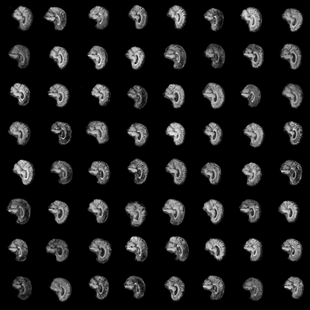 | 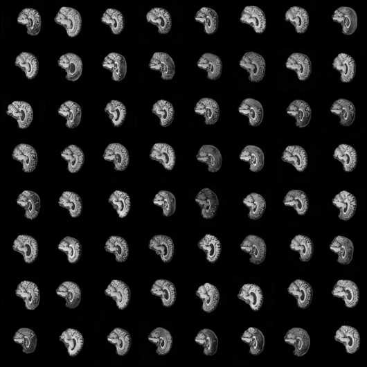 |

*Uncurated generated ADNI slices at 64 × 64. StyleGAN2 produces sharper cortical folds, cleaner outlines and a wider range of head positions.*

## 2. Feasibility Review

*Presented at the midpoint check-off on 27/10/2026.*

**Aim.** To find out whether StyleGAN2 generates more realistic ADNI brain slices than a WGAN-GP baseline without moving closer to its training patients, so a project manager can decide whether the synthetic cohort is safe to share.

**User need, scope and acceptance criteria.** An imaging research team wants to share a synthetic cohort of cognitively normal and Alzheimer's disease brain slices without breaching patient confidentiality. Scope: StyleGAN2 generating 64 × 64 sagittal slices (128 × 128 if the budget allows), plus an audit of whether its output is realistic, novel and safe to share.

1. **Fidelity:** lower FID against held-out test slices than the baseline at the same resolution; median nearest-neighbour SSIM to real slices above 0.6.
2. **No copies:** none of 3,100 generated slices reaches copy level (Section 7).
3. **Memorisation:** at the selected checkpoint, a flag rate and matched-reference excess no higher than the baseline's at equal or better FID.
4. **Coverage:** a t-SNE or UMAP embedding shows generated slices across both classes and the range of slice positions.
5. **Resources:** one A100 (40 GB), resumable jobs of 12 hours or less, at most 24 GPU-hours per configuration (an estimate; measured in the first run).

**Model choice and course concepts.** StyleGAN2 [Hard difficulty] on ADNI (`/home/groups/comp3710/ADNI`), unconditional first. It extends the course's GAN material (adversarial training, convolutional generators and discriminators, regularisation). A mapping network turns the latent vector into a style vector that modulates every synthesis layer, giving fine texture and a latent space that can be analysed with PCA and interpolation (Karras et al., 2019, 2020). R1 and path-length regularisation stabilise training, and adaptive discriminator augmentation targets small datasets; with 542 training patients, overfitting is the central risk. Liu, Chandra et al. (2023) apply style-based models to neuroimaging. The baseline is my Lab 2 WGAN-GP (Gulrajani et al., 2017), sharing the same data pipeline and evaluation.

**Plan.** (1) FID for every baseline snapshot, giving a fidelity-versus-memorisation curve. (2) A minimal StyleGAN2, verified on OASIS 64 px. (3) StyleGAN2 on ADNI 64 px, measuring memory and time. (4) Add augmentation, then diagnosis conditioning, auditing every snapshot. (5) Embeddings, a failure autopsy and the final recommendation.

**Preliminary feasibility evidence.**

| Evidence | Result |
|---|---|
| Data audit and split | The provided split leaks 216 of 680 patients; re-split 80/10/10 by patient (542 / 68 / 68) |
| Memorisation audit | Thresholds from validation patients flag 0.3–0.9% of unseen test patients and at least 99.2% of near-duplicates |
| Baseline | Reproduces Lab 2 on OASIS; on ADNI 64 px, 15,100 iterations in 25 min using 0.43 GB |
| Baseline audit | No copies; flag rate rises from 0.03% to 4.2% over training |

**Risks, budget and fallback.** Instability or mode collapse: watched through loss curves, sample grids and per-snapshot audits, and mitigated by R1 and augmentation. Compute: measured at 64 px before scaling. Memorisation: checkpoints chosen on the fidelity-versus-memorisation curve. Class confound: slice windows differ by class (Discovery 9), so the model is unconditional first. The audit barely recognises a patient across visits, so a feature-space check is added. Budget: about 30 A100-hours (an estimate). Fallback: StyleGAN2 at 64 px with a reduced network, which keeps the Hard tier; the comparison and audit stand either way.

---

## 3. Dataset

### 3.1 Source

The preprocessed ADNI subset provided on the Rangpur cluster at `/home/groups/comp3710/ADNI`. It contains 2D JPEG slices only. The metadata JSON references NIfTI volumes and tissue segmentations, but those files are not included, so the JSON is used only for labels and patient identity.

### 3.2 Directory structure

```
/home/groups/comp3710/ADNI/
├── meta_data_with_label.json      # metadata for 2,189 ADNI scans
└── AD_NC/
    ├── train/
    │   ├── AD/                     # <scanID>_<sliceIndex>.jpeg
    │   └── NC/
    └── test/
        ├── AD/
        └── NC/
```

The folders use **NC** (normal control); ADNI and the metadata use **CN** (cognitively normal). They are the same group, and this project uses CN throughout.

### 3.3 Provided split

| Split | Class | Slices | Scans | Slices per scan |
|---|---|---:|---:|---:|
| train | AD | 10,400 | 520 | 20 |
| train | CN | 11,120 | 556 | 20 |
| test | AD | 4,460 | 223 | 20 |
| test | CN | 4,540 | 227 | 20 |
| **Total** | | **30,520** | **1,526** | |

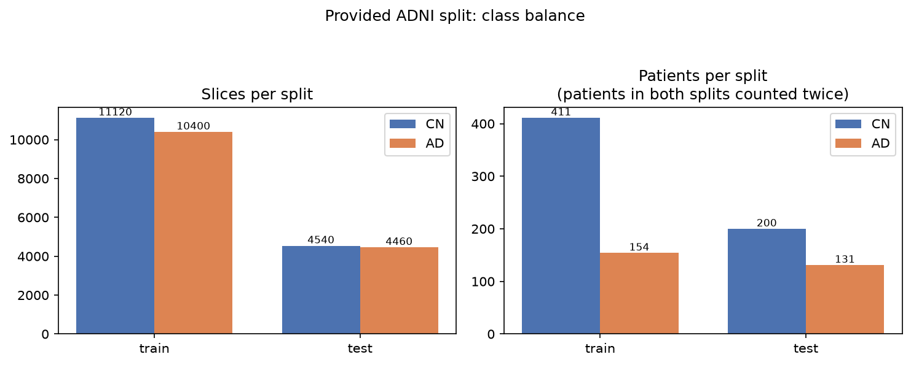

### 3.4 Image properties

| Property | Value |
|---|---|
| Format | JPEG, 8-bit single-channel greyscale (PIL mode `L`) |
| Dimensions | 256 px wide × 240 px high (all 30,520 files) |
| Slices per scan | Exactly 20, always contiguous (slice index step of 1), for all 1,526 scans |
| Slice index range | 67–114 overall; each scan covers a different 20-slice window |
| Window start index | CN: median 88 (range 67–95); AD: median 78 (range 70–95) |
| Duplicates | None (no byte-identical files) |
| Background | 74% of pixels are near-black (intensity < 10) in both classes |
| File naming | `<scanID>_<sliceIndex>.jpeg`, where `scanID` is the ADNI image ID |
| View | Sagittal, skull-stripped (cerebellum, corpus callosum, and lateral ventricle visible) |
| Brain size | Median 167 H × 146 W px within the padded 256 × 256 frame; midline slices nearly fill the frame |
| Data quality | 2 corrupted scans (40 slices) excluded; 3 scans whose brains touch the top edge are kept (Discoveries 11–12) |

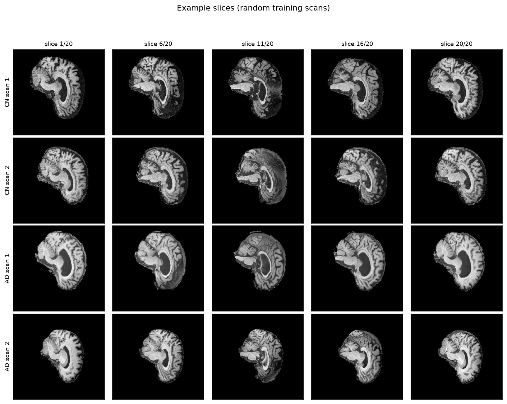

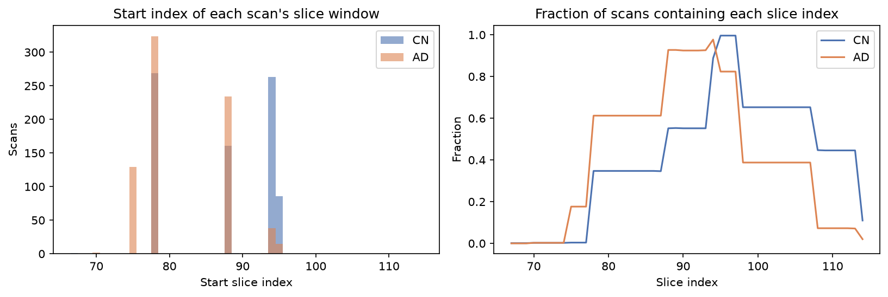

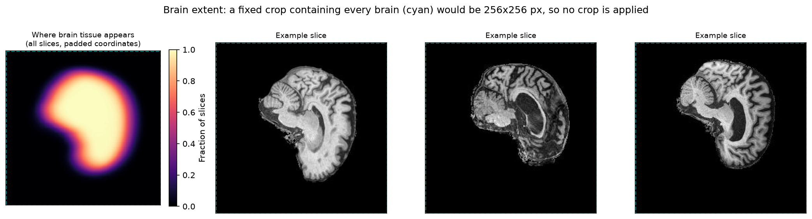

### 3.5 Metadata JSON

`meta_data_with_label.json` maps each ADNI image ID (the `scanID` in filenames) to file paths and a diagnostic label.

| Field | Contents |
|---|---|
| `raw` | Path to the original T1-weighted MPRAGE volume. The filename embeds the patient ID (`ADNI_XXX_S_XXXX`) |
| `masked` | Path to a masked, N4 bias-corrected volume (per the filename) |
| `c1`–`c5` | Paths to binarised SPM tissue segmentations |
| `label` | Diagnosis: 0 = CN, 1 = MCI, 2 = AD |

| Label | Diagnosis | JSON entries | In this dataset |
|---:|---|---:|---:|
| 0 | CN | 810 | 783 scans |
| 1 | MCI | 625 | 0 (excluded) |
| 2 | AD | 754 | 743 scans |

All 1,526 scans in the folders have a JSON entry, and every folder label agrees with its JSON label.

### 3.6 Patient-level structure

The 1,526 scans come from **680 patients**, many of whom were scanned at multiple visits.

| Class | Patients | Scans | Scans per patient |
|---|---:|---:|---:|
| CN | 459 | 783 | 1.71 |
| AD | 221 | 743 | 3.36 |
| **Total** | **680** | **1,526** | 2.24 |

| Scans per patient | 1 | 2 | 3 | 4 | 5 | 6 | 7 | 8 |
|---|---:|---:|---:|---:|---:|---:|---:|---:|
| Patients | 282 | 214 | 67 | 40 | 37 | 18 | 14 | 8 |

No patient changes diagnosis between visits: every patient is either CN-only or AD-only.

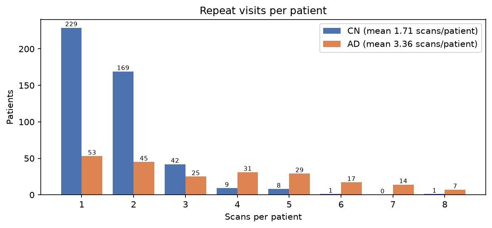

---

## 4. Dataset Discoveries and Fixes

| # | Discovery | Evidence | Impact | Fix |
|---|---|---|---|---|
| 1 | Filename IDs identify **scans, not patients** | JSON keys match the `I<ID>` suffix of ADNI image paths; 1,526 scan IDs map to 680 patients | Splitting by filename ID keeps a patient's other visits on both sides of the split | Extract the patient ID from the JSON `raw` path and split by patient |
| 2 | The provided train/test split **leaks patients** | 216 of 680 patients (32%) have scans in both train and test; 216 of the 331 test patients (65%) also appear in training | Held-out comparisons (FID, memorisation audit) would be contaminated by patients the model has seen | Discard the provided split and re-split at patient level (Section 5.2) |
| 3 | MCI scans are excluded | JSON contains 625 MCI entries; none appear in the folders | None for this task; the problem is CN vs AD only | Use only labels 0 and 2 |
| 4 | No diagnostic conversions | 459 CN-only and 221 AD-only patients | Each patient has one unambiguous class | Stratify the split by patient label |
| 5 | AD patients have about twice as many visits | 3.36 vs 1.71 scans per patient | Slice-level class balance shifts after re-splitting, and AD contributes most of the same-patient pairs in the memorisation audit | Report every split statistic and every audit threshold and rate per class |
| 6 | Images are not square | 256 wide × 240 high | StyleGAN2 requires square power-of-two resolutions | Zero-pad the height to 256 (8 rows top and bottom) |
| 7 | Slice windows differ between scans | Each scan has 20 contiguous slices, but window start positions vary across scans | The same slice index shows different anatomy in different scans | Memorisation comparisons use nearest-neighbour search over slices rather than matched indices |
| 8 | Background dominates every image | 74% of pixels are near-black (< 10) in both classes | Pixel metrics such as SSIM are inflated by shared black background, making any two brains look similar | Masked SSIM is the primary audit metric: at the same false-flag rate it detects 80% of AD same-session repeat scans, against 48% for whole-image SSIM (Section 7.3) |
| 9 | Slice windows are **class-dependent** | AD windows start at a median slice index of 78; CN windows at 88 | Class is confounded with anatomical level: a class-conditional model could learn "which part of the brain" rather than disease-related anatomy, and CN vs AD comparisons partly compare different brain regions | Compare classes at matched slice positions where possible, and account for the offset when interpreting conditional generation and per-class metrics |
| 10 | The brain already fills most of the frame | Median brain box 167 H × 146 W px in the padded 256 × 256 image; between the 0.1th and 99.9th percentiles, brain boxes span rows 8–228 and columns 14–239 | A fixed crop (which must contain every brain, so that brain size and position are not altered per image) would be the full frame and gain no resolution | No crop: padding only (`ADNI_CROP = None`) |
| 11 | Two scans are corrupted | Per-scan mean intensity of 0.9 and 7.8, against a median of 29.2 and a 1st percentile of 21.2. With contrast stretched, one is blocky noise; the other mixes a non-skull-stripped head with pure-noise slices. The first also accounts for all 3 empty slices and the only left-edge contact | A GAN would learn near-black or noise images as valid brains | Exclude scans with mean intensity < 0.5 × the median scan mean (14.6), applied after the patient split so no split assignment changes. Removes 2 scans (40 slices) belonging to 2 CN training patients with no other scans |
| 12 | Three scans' brains touch the top edge | 45 slices from 3 scans reach original row 0 | Visual inspection shows complete, anatomically normal brains positioned high in the frame | Kept |
| 13 | Some patients have **same-day repeat scans** | Acquisition dates and series IDs parsed from the metadata `raw` path (1,226 of 1,226 training scans). Training contains 253 same-day scan pairs (81 CN, 172 AD). CN same-day pairs have a median masked pair SSIM of 0.992 (58% above 0.99); no pair from different days exceeds 0.99 | A "same-person" memorisation threshold is pushed to about 1.0, so only pixel-perfect copies would be flagged. Repeat scans also count a patient's anatomy twice in training | Same-day pairs become a copy reference in the audit instead of setting the threshold (Section 7) |
| 14 | Visits on different days are **not aligned** | Different-day pairs share all 20 slice indices, yet each slice's best match is a median of 4 slices away and the median masked pair SSIM is 0.29–0.32 at every gap (under 6 months to over 2 years) | The same patient's other visit looks less similar than the nearest stranger among 24,520 training slices, so pixel SSIM cannot recognise a patient across visits | Threshold calibrated on validation strangers; different-day pairs reported as an identity reference and a stated limitation (Section 7) |

No byte-identical duplicate images exist across the 30,520 files.
**Open observations.** AD same-day pairs are a mixture: a few near-identical repeats, but most have a pair SSIM around 0.75–0.8, with a thin tail down to 0.2–0.5. Different acquisition protocols on the same day are a plausible cause, to be checked against the series descriptions. Two AD scan pairs share a series ID yet have a pair SSIM of only 0.36, which is not yet explained.

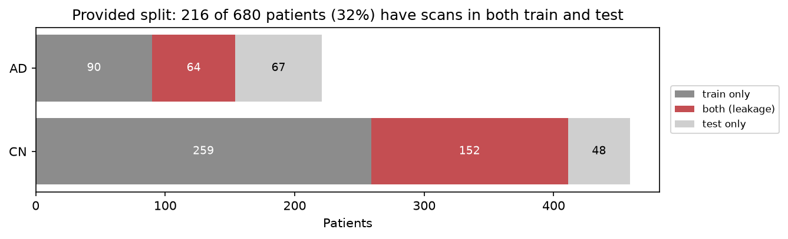

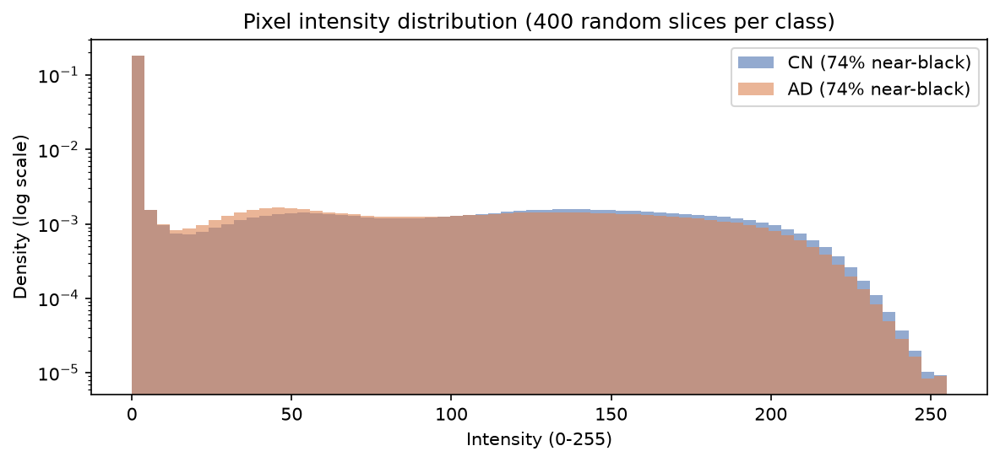

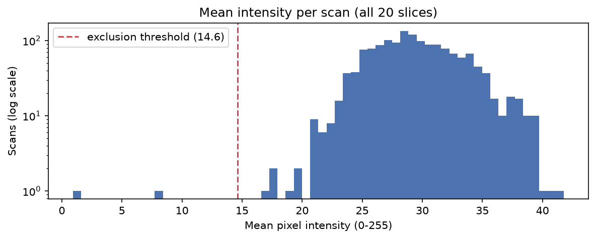

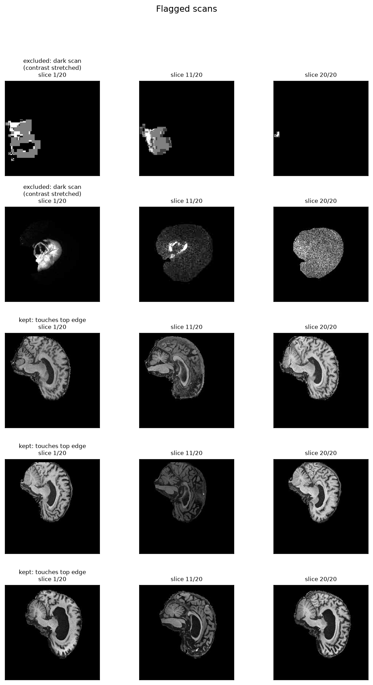

---

## 5. Preprocessing and Data Splits

### 5.1 Preprocessing pipeline

1. **Index:** record each slice's scan ID, slice index, position within its 20-slice window, and class. Attach the patient ID from the metadata JSON at runtime.
2. **Split:** assign every patient to train, validation, or test using all scans (Section 5.2). All slices of a patient's scans inherit that patient's split.
3. **Exclude corrupted scans:** drop scans whose mean intensity is below 0.5 × the median scan mean (Discovery 11). This happens after splitting, so it never changes any patient's split assignment.
4. **Pad:** zero-pad each 240 × 256 slice to 256 × 256 (8 rows top and bottom). Zero matches the existing background and preserves the anatomy's aspect ratio, which resizing directly would distort.
5. **No crop:** a fixed crop containing every brain would be the full frame (Discovery 10).
6. **Resize:** downsample with antialiasing to the working resolution: 64 × 64 during development, then 128 × 128 and 256 × 256.
7. **Scale:** map intensities from [0, 255] to [−1, 1], matching the generator's `tanh` output range.
8. **Preload:** hold all slices in memory as `uint8` and convert to float per batch, with an on-disk cache outside the repository. At 64 × 64 the training split occupies 100 MB, and the first load takes about 20 s with 8 workers.

Data augmentation is not yet decided. It will be introduced with adaptive discriminator augmentation (ADA) in a later iteration.

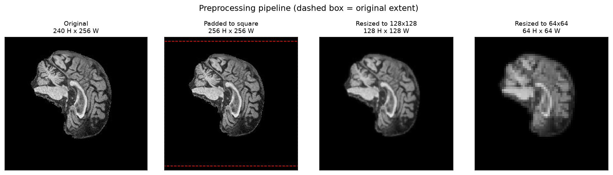

### 5.2 Split strategy

| Split | Share of patients | Purpose |
|---|---:|---|
| train | 80% (~544 patients) | Training StyleGAN2 and the WGAN-GP baseline |
| validation | 10% (~68 patients) | FID tracking and checkpoint selection during training |
| test | 10% (~68 patients) | Final FID and the memorisation audit's held-out comparisons |

**Why re-split rather than use the provided split:** the provided split places 216 patients on both sides (Discovery 2). For a generative model, a clean held-out set is what makes the memorisation audit meaningful: if held-out patients were seen in training, similarity between generated and held-out images proves nothing.

**Why patient-level and stratified:** all visits of a patient stay in one split, and stratifying by patient label keeps the CN:AD patient ratio equal across splits. The split is generated deterministically from a fixed seed.

**Why no split file is committed:** ADNI's data use agreement restricts redistribution, so patient identifiers are kept out of this public repository. The split is regenerated from the seed at runtime.

Resulting split (seed 42), verified by the `dataset.py` smoke test, which also asserts that no patient or scan appears in more than one split:

| Split | Patients (CN / AD) | Scans (CN / AD) | Slices (CN / AD) | AD share of slices |
|---|---:|---:|---:|---:|
| train | 365 / 177 | 622 / 604 | 12,440 / 12,080 | 49.3% |
| val | 46 / 22 | 72 / 71 | 1,440 / 1,420 | 49.7% |
| test | 46 / 22 | 87 / 68 | 1,740 / 1,360 | 43.9% |
| **Total** | **678** | **1,524** | **30,480** | |

Both excluded scans (Discovery 11) belonged to CN patients in the training split who had no other scans, so train holds 365 CN patients rather than the 367 assigned. Validation and test are unaffected.

Stratification balances patients, not slices. Because AD patients have between 1 and 8 scans each, the slice-level class balance varies between splits (the test split has fewer AD scans), so all evaluation metrics are reported per class rather than pooled.

---

## 6. Design Decisions

| Decision | Choice | Rationale |
|---|---|---|
| Model | StyleGAN2, pure-PyTorch implementation in `modules.py` | Style modulation gives fine texture and a structured latent space; written from the paper rather than adapted from NVIDIA's code, which relies on custom CUDA kernels |
| Baseline | WGAN-GP | Previously implemented and validated on OASIS brain slices; retrained on the same ADNI split for a like-for-like comparison |
| Verification dataset | OASIS brain slices at 64 × 64 | A known-good WGAN-GP result exists at this setting, so a new StyleGAN2 implementation that underperforms it indicates a bug |
| Resolution | 64 × 64 for all experiments | Each StyleGAN2 run takes about 67 minutes at 64 px; the compute went into replicated comparisons (four ADNI runs, every snapshot audited) rather than higher resolution. 128 and 256 px are supported by the code but untested |
| Split | Patient-level, label-stratified, 80/10/10, fixed seed | Removes the leakage in the provided split (Section 4) |
| Privacy | No patient IDs or split files committed | ADNI data use terms |
| Memorisation audit | Nearest-neighbour masked SSIM to the training set, with per-class thresholds calibrated on validation patients and checked on test patients | Calibrated on real data instead of an arbitrary cutoff; the originally planned same-person threshold proved invalid (Section 7.1) |
| Code organisation | `modules.py`, `dataset.py`, `train.py`, `predict.py`, plus `audit.py` and `data_audit.py` | Required structure; model code depends only on PyTorch |
| Brain crop | None (padding only) | Measured: a crop containing every brain is the full frame (Discovery 10) |
| Scan quality filter | Exclude scans with mean intensity < 0.5 × median, after the patient split | Removes the two corrupted scans with a relative rule rather than hard-coded IDs, without altering the split (Discovery 11) |
| Simplified resampling and width | Bilinear upsampling and average pooling instead of transposed convolutions with FIR blur; channels capped at 256 | Simpler code that fits the budget; the OASIS check confirmed the implementation produces sharp, varied brains |
| Training length | 15,100 iterations (966 thousand real images shown) for every model | Equal real-image budget for a like-for-like comparison, matching the verified Lab 2 baseline run |
| Checkpoint selection | Every 2,500-iteration snapshot audited; checkpoint chosen on fidelity and memorisation together | The baseline already showed memorisation rising with training, so the final snapshot is not automatically the best |
| ADA augmentations | Translation, isotropic scaling, rotation, brightness, contrast; no flips or colour | A mirrored sagittal slice is anatomically wrong, and the data is greyscale |
| Evaluation features | Inception-v3 (standard FID weights) for FID, precision/recall, density/coverage and t-SNE | Standard and comparable across runs; its weak sensitivity to AD-specific anatomy is reported as a limitation (Section 11.6) |
---

## 7. Memorisation Audit

**Question:** is a generated brain a new brain, or a copy of a training image?

Each generated slice is compared with its nearest neighbour in the training set. The decision threshold is calibrated on real data rather than chosen arbitrarily. Validation patients were never seen in training, so their slices show how close a genuinely new brain gets to the training set by chance. A generated slice closer to a training slice than 99% of new real brains get is flagged and inspected side by side with its neighbour. Every rung except the generated one uses real data only, so the audit is calibrated before any model is trained (`audit.py`).

### 7.1 From the original design to the current one

The original design took the threshold from repeat visits of the same patient. The first calibration run showed that this fails, and a visit-pair diagnostic that dates each scan from its metadata path explained why (Discoveries 13 and 14):

- **Same-day repeat scans are near-identical** (CN median pair SSIM 0.992). They pushed the 95th-percentile same-person threshold to 0.9995 for CN, so a generator would have to copy almost pixel-perfectly to be flagged.
- **Visits on different days are not aligned.** A patient's other visit scores lower (median masked SSIM 0.30) than the nearest stranger among 24,520 training slices (median 0.59), so pixel SSIM does not recognise a patient across visits.

Same-day and different-day pairs are therefore kept as reference rungs, and the threshold now comes from strangers.

### 7.2 Similarity ladder

| Rung | Comparison | Role |
|---|---|---|
| Near-duplicate | Adjacent slices of the same training scan | Copy reference: a copy displaced by one slice should be flagged |
| Same session | Training slice → nearest slice of another scan of the same patient acquired on the same day | Copy reference: a repeat acquisition should be flagged |
| Different day | Training slice → nearest slice of the same patient's scans from other days | Identity reference: does the metric recognise a patient across visits? |
| Stranger (val) | Validation slice → nearest training slice | **Calibration:** threshold = 99th percentile, per class and metric |
| Stranger (test) | Test slice → nearest training slice | False-flag check on patients not used for calibration |
| Generated | Generated slice → nearest training slice | Under evaluation |

### 7.3 Results at 64 × 64

All 2,860 validation and 3,100 test slices were searched against all 24,520 training slices. The table shows the share of each rung at or above the class threshold:

| Rung | Role | CN whole | CN masked | AD whole | AD masked |
|---|---|---:|---:|---:|---:|
| Near-duplicate | copy | 99.6% | 99.2% | 99.7% | 99.5% |
| Same session | copy | 92.3% | 93.9% | 47.6% | 80.2% |
| Different day | identity | 3.8% | 4.0% | 9.0% | 10.7% |
| Stranger (val) | calibration | 1.0% | 1.0% | 1.1% | 1.1% |
| Stranger (test) | false flags | 0.7% | 0.3% | 0.9% | 0.6% |
| **Threshold (SSIM)** | | 0.863 | 0.716 | 0.856 | 0.694 |

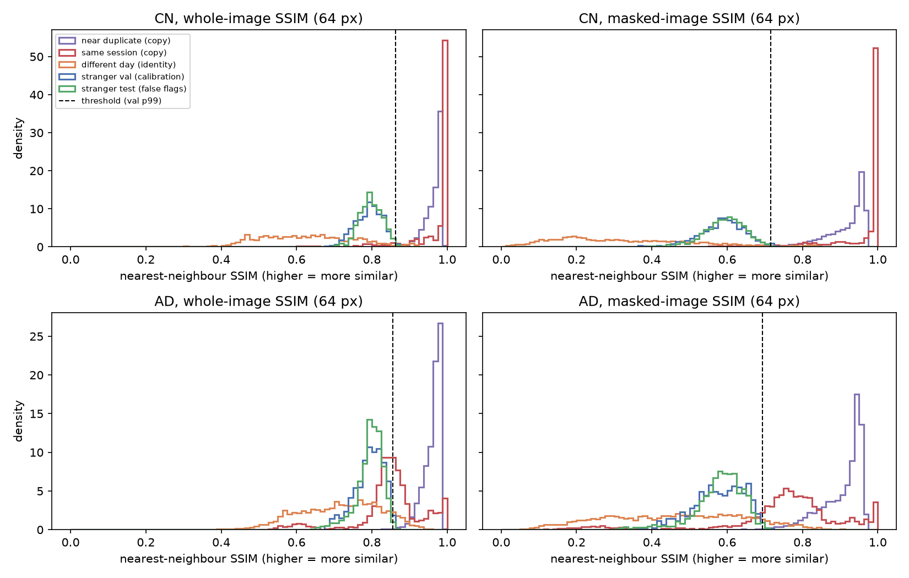

*Nearest-neighbour SSIM to the training set at 64 px. The threshold (dashed) is the 99th percentile of validation strangers. Copy references (purple, red) fall above it and test strangers (green) below it; different-day visits of the same patient (orange) mostly fall below it.*

**Findings:**

1. **The calibration transfers to unseen patients.** Test strangers are flagged at 0.3–0.9%, matching the nominal 1%. A generator producing genuinely new brains should therefore see about 1% of its samples flagged; a clearly higher rate is evidence of copying.
2. **The audit catches copies.** At least 99.2% of near-duplicates are flagged, even though the anatomy shifts by one slice, as are 92–94% of CN same-day repeats.
3. **Masked SSIM is the primary metric.** At the same false-flag rate, it flags 80% of AD same-session pairs against 48% for whole-image SSIM, because shared background hides real differences (Discovery 8).
4. **Limitation: the audit barely sees identity.** Only 4% (CN) and 11% (AD) of different-day slices are flagged. That is above the 1% stranger rate, so some identity signal exists, but a generator that reproduces a training patient's anatomy in a new head position would mostly pass. A feature-space check is planned: whether Inception features find a patient's other visit more often than chance.
5. **Limitation: SSIM neighbours carry little class information.** The nearest training slice shares the test slice's class 59–61% of the time for CN and 51.5% for AD, against 50.7% CN among training slices. SSIM audits copying, not whether generated AD brains look like AD.

### 7.4 Implementation details

- **SSIM** follows Wang et al. (2004): 11 × 11 Gaussian window (σ = 1.5), K₁ = 0.01, K₂ = 0.03, data range 1, computed with valid convolution so borders never mix with padding. It agrees with scikit-image's `structural_similarity` to within 5 × 10⁻⁶ on test images.
- **Masked SSIM** averages the SSIM map over the union of both images' brain pixels (intensity > 10). Background that is black in both images is ignored, but brain present in only one image still counts against the pair.
- **Nearest-neighbour search everywhere**, because slice windows differ between scans and generated slices have no known position (Discovery 7). Each metric picks its own nearest neighbour. Per-image statistics are computed once, so each comparison only adds the cross term, run as batched GPU operations in PyTorch.
- **Per-class thresholds.** The masked thresholds for CN (0.716) and AD (0.694) are close, so an unconditional generator can be audited against a pooled threshold.
- **Resolution-specific.** These thresholds hold at 64 × 64 only and are recomputed at each training resolution.
- **Cost:** 77 queries per second against 24,520 training slices, 6.0 GB peak GPU memory, about 1.5 minutes for the full run on one A100.
- **Caveats.** The 99th percentile rests on about 14 slices per class from 68 validation patients, and slices from one patient are correlated; a patient-level bootstrap of the threshold is the next refinement if a generator's flag rate lands near 1%. Acquisition dates come from the timestamp in the metadata `raw` path, which behaves as an acquisition date: no pair from different days exceeds an SSIM of 0.99.

### 7.5 Reproducing the audit

```bash
sbatch audit.sh                      # full run, about 1.5 min on one A100
sbatch audit.sh --max_queries 500    # quick run with subsampled stranger queries
```

Results are written to `outputs/audit/` (gitignored; local split indices only, no patient IDs) and the figure to `figures/audit_ladder_r64.png`.

**Rangpur notes.** Jobs on the `comp3710` partition must be charged to the `comp3710` account (`#SBATCH --account=comp3710`), because the partition only accepts that account and a student's default account differs. The nodes expose no schedulable memory, so `--mem` must be omitted; otherwise the job waits indefinitely with reason `PartitionConfig`. The course guide's example `job.sh` includes `--mem=16G`.

---

## 8. Reproducing the Dataset Audit

All statistics and figures in Sections 3 and 4 come from `data_audit.py`. On Rangpur:

```bash
srun --partition=cpu --time=00:45:00 --pty bash
conda activate torch
python data_audit.py            # prints statistics, writes figures/ next to the script
exit
```

The script prints only aggregate statistics and never writes patient IDs to disk.

---

## 9. Dependencies

All experiments ran on UQ's Rangpur cluster: one NVIDIA A100-PCIE-40GB per job, Slurm partition `comp3710`.

| Package | Version | Used for |
|---|---|---|
| Python | 3.11.15 | |
| PyTorch | 2.13.0 (CUDA 13.0) | all models, training, SSIM audit |
| torchvision | 0.28.0 | image I/O, sample grids |
| NumPy | 2.4.6 | evaluation and plotting only (not in model code) |
| SciPy | 1.17.1 | FID matrix square root |
| scikit-learn | 1.9.0 | PCA and t-SNE (`embed.py`) |
| matplotlib | 3.11.1 | figures |
| Pillow | 12.3.0 | JPEG loading |
| pytorch-fid | 0.3.0 | standard FID Inception-v3 weights |

**Reproducibility.** The patient split is deterministic (seed 42, `random.Random`); training seeds are fixed (`--seed`, default 42); evaluation samples use a fixed latent seed (`predict.py --seed`, default 0), including StyleGAN2's per-pixel noise. GPU convolutions are not bit-for-bit deterministic, so retraining reproduces the reported trends and approximately, not exactly, the reported numbers. Each configuration was trained once (Section 11.11).

## 10. Usage

All commands run from `recognition/StyleGAN2_ADNI_s4883100/` on Rangpur. Every `.sh` script is a Slurm batch script that passes its arguments through to the Python script of the same name.

**Rangpur notes.** Jobs on the `comp3710` partition must use `#SBATCH --account=comp3710`, and must not request `--mem` (the nodes expose no schedulable memory; such jobs wait forever with reason `PartitionConfig`). The scripts here already do both.

```bash
# 1. Data: audit and preprocessing smoke test (CPU node)
srun --partition=cpu --cpus-per-task=8 --time=00:45:00 --pty bash
conda activate torch
python data_audit.py
python dataset.py --resolution 64          # builds the cached 64 px tensors, checks the split
exit

# 2. Calibrate the memorisation audit on real data (about 2 min)
sbatch audit.sh

# 3. Train (about 25 min for WGAN-GP, 67 min for StyleGAN2 at 64 px)
sbatch train.sh --dataset oasis --run_name wgan_oasis64                       # verify the baseline port
sbatch train.sh --dataset adni --run_name wgan_adni64                         # baseline
sbatch train.sh --model stylegan2 --dataset oasis --run_name sg2_oasis64      # verify StyleGAN2
sbatch train.sh --model stylegan2 --dataset adni --run_name sg2_adni64        # main model
sbatch train.sh --model stylegan2 --dataset adni --run_name sg2_adni64_r1g01 --r1_gamma 0.1
sbatch train.sh --model stylegan2 --dataset adni --run_name sg2_adni64_ada --ada
# add --resume to continue a run that hit its time limit

# 4. Evaluate every snapshot: memorisation audit, fidelity, trade-off figure, direct comparison
sbatch predict.sh --run_name wgan_adni64 --snapshots all
sbatch predict.sh --run_name sg2_adni64 --snapshots all --compare wgan_adni64 --compare_excess wgan_adni64
sbatch predict.sh --run_name sg2_adni64 --snapshot 10000                     # figures for one snapshot

# 5. Embedding and failure autopsy
sbatch embed.sh --runs wgan_adni64:10000 sg2_adni64:10000 sg2_adni64_ada:15100
sbatch autopsy.sh --run_name sg2_adni64 --iter 10000 --copy_iter 12500
```

**Outputs.** Training writes to `outputs/runs/<run_name>/` (config, loss history and curves, fixed-noise sample grids, generator snapshots every 2,500 iterations, a resumable checkpoint). Evaluation writes JSON results to `outputs/eval/<run_name>/` and figures to `figures/`. `outputs/` is gitignored; no weights or data are committed.

**Example input and output.** The input to a trained generator is a random latent vector; the output is a 64 × 64 greyscale slice in [−1, 1]. `predict.py` loads a snapshot, generates 3,100 slices and prints tables such as:

```text
 iter metric   flagged    rate            95% CI   NN p5  NN p50  NN p95
10000 masked       174   5.61% [ 4.86%,  6.48%]  0.5081  0.6229  0.7063
      set      FID  precision   recall  density  coverage
gen 10000    13.67      0.347    0.237    0.369     0.421
```

## 11. Results

All results are at 64 × 64, from 3,100 generated slices per snapshot, compared with the 3,100 held-out test slices (68 patients) and the 24,520 training slices. Four ADNI runs share the same data, batch size (64) and training length (15,100 iterations):

| Run | Model | Change |
|---|---|---|
| `wgan_adni64` | WGAN-GP baseline | ported unchanged from Lab 2 |
| `sg2_adni64` | StyleGAN2 | default R1 weight (γ = 0.0128) |
| `sg2_adni64_r1g01` | StyleGAN2 | stronger R1 (γ = 0.1) |
| `sg2_adni64_ada` | StyleGAN2 | adaptive discriminator augmentation |

### 11.1 Verifying both implementations on OASIS

Before ADNI, both models were trained on OASIS 64 × 64, where a known-good result exists (my Lab 2 WGAN-GP). The ported baseline reproduced Lab 2: its Wasserstein estimate fell to a minimum of 2.5 around epoch 20 and drifted up to 4.1 by epoch 100 (Lab 2: about 3.2 and 4.3), and its samples matched in realism and variety. StyleGAN2 at the same budget produced visibly sharper ventricles, folds and outlines with similar variety. Problems on ADNI can therefore be attributed to the data or the task, not to the implementations.

| WGAN-GP on OASIS | StyleGAN2 on OASIS |
|---|---|
| 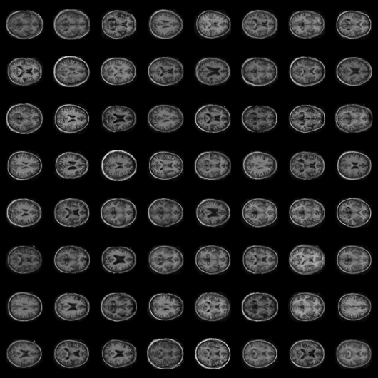 | 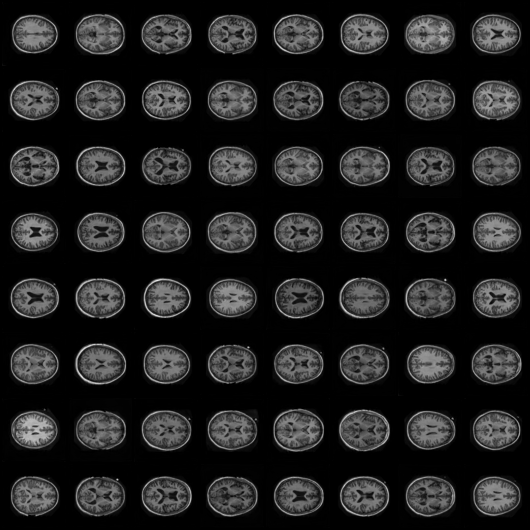 |

### 11.2 Fidelity

| Run, iteration | FID ↓ | Precision | Recall | Density | Coverage |
|---|---:|---:|---:|---:|---:|
| Baseline, 10,000 | 48.4 | 0.056 | 0.322 | 0.039 | 0.080 |
| Baseline, 15,100 | 49.2 | 0.085 | 0.288 | 0.060 | 0.107 |
| StyleGAN2, 10,000 | 13.7 | 0.347 | 0.237 | 0.369 | 0.421 |
| StyleGAN2, 15,100 | 12.6 | 0.285 | 0.341 | 0.259 | 0.387 |
| Stronger R1, 15,100 | 12.0 | 0.280 | 0.426 | 0.272 | 0.392 |
| ADA, 15,100 | 11.4 | 0.305 | 0.397 | 0.299 | 0.417 |
| *Real validation vs test (reference)* | *6.3* | *0.331* | *0.331* | *0.351* | *0.478* |

FID compares Inception-v3 feature distributions (lower is better). Precision and density measure realism (generated slices that fall where real slices do); recall and coverage measure how much of the real variety is reproduced. The real-vs-real row is what a perfect generator would score at these sample sizes: 20 near-identical adjacent slices per scan keep all four neighbourhood metrics low even for real data, so values are judged against it.

StyleGAN2 is about 4× better than the baseline on FID, and at 10,000 iterations its precision and density match real data and its coverage reaches 88% of the real reference (baseline: 17%). The baseline's recall (0.32) looked respectable but was inflated by off-manifold samples; coverage, which only uses real slices' neighbourhoods, exposed this. Differences between the three StyleGAN2 variants (about 1 FID point) are within what single runs can resolve. The spec's SSIM target (> 0.6) is met: the median nearest-neighbour SSIM of StyleGAN2 slices to real training slices is 0.80 over the whole image and 0.62 over the brain.

### 11.3 Memorisation

| Run, iteration | Masked flag rate | Excess over control (95% CI) | Copy-level slices | Max masked SSIM |
|---|---:|---|---:|---:|
| Baseline, 10,000 | 2.29% | +0.0056 [−0.0027, +0.0134] | 0 | 0.754 |
| Baseline, 15,100 | 4.19% | +0.0067 [−0.0016, +0.0142] | 0 | 0.760 |
| StyleGAN2, 10,000 | 5.61% | −0.0000 [−0.0084, +0.0078] | 0 | 0.788 |
| StyleGAN2, 15,100 | 5.81% | +0.0040 [−0.0044, +0.0118] | 0 | 0.785 |
| Stronger R1, 15,100 | 7.00% | +0.0063 [−0.0019, +0.0139] | 0 | 0.778 |
| ADA, 15,100 | 5.19% | +0.0048 [−0.0035, +0.0124] | 0 | 0.784 |
| *Real unseen test patients* | *0.61%* | | | |

Three findings:

1. **The flag rate is confounded with realism.** StyleGAN2 is flagged 5–7% of the time against the baseline's 0.5–4.2%, yet its slices are about as close to unseen validation patients as to training patients. Realistic, typical slices resemble real brains in general more closely than real strangers resemble each other, so a more realistic generator is flagged more whatever it has memorised. The clearest case: at 5,000 iterations StyleGAN2 is flagged 7.0% against the baseline's 0.5%, yet its training-specific excess is no higher (difference −0.0018, 95% CI [−0.0042, +0.0005]).
2. **The matched-reference test separates the two.** It asks whether generated slices are closer to training patients than to equally many unseen patients, with real test slices as a control (Section 7). Comparing two models directly cancels the control's noise. **StyleGAN2 is pulled towards its training patients significantly less than the baseline** at every snapshot from 7,500 iterations (masked difference at 10,000: −0.0056, 95% CI [−0.0079, −0.0033]; at 15,100: −0.0027 [−0.0051, −0.0005]; whole-image intervals below zero from 7,500 to 15,100).
3. **No model copies training slices at the recommended checkpoint.** No run produced a copy-level slice (masked SSIM ≥ 0.796, the 5th percentile of adjacent slices from the same scan) at 10,000 or 15,100 iterations, and flagged slices spread across many training slices and patients (e.g. StyleGAN2 at 15,100: 180 flags over 176 training slices from 109 patients). Two runs produced exactly one copy-level slice each at 12,500 iterations (Section 11.7).

### 11.4 The fidelity-versus-memorisation trade-off

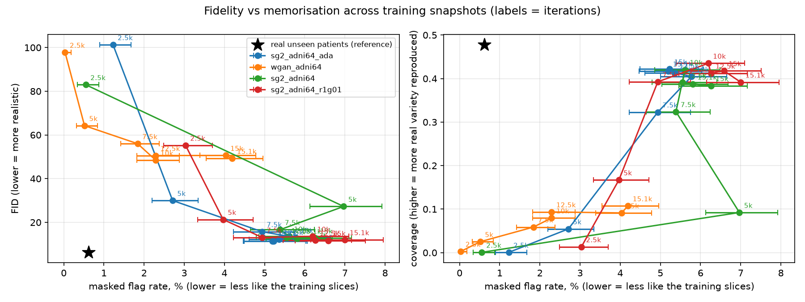

*FID and coverage against the masked flag rate for every snapshot of all four runs (labels are iterations; the star is real unseen patients).*

For every model, realism improves steeply early and then flattens, while resemblance to the training data keeps rising. The baseline's FID stops improving after about 10,000 iterations while its flag rate nearly doubles. All three StyleGAN2 variants show a small, late training-specific drift: the excess is near zero up to 10,000 iterations and rises to +0.004 to +0.006 by 15,100. No individual excess is significant, but the trend is consistent across runs and subsets.

### 11.5 Testing why the late drift happens

From about 9,000 iterations, default StyleGAN2's discriminator sharpened: its loss fell from 1.0 to 0.68, its real and fake scores separated from ±0.7 to ±1.3, and its R1 gradient penalty rose from about 10 to 20–35. This coincided with the drift, suggesting the hypothesis that a discriminator memorising the training slices pulls the generator towards them. Two runs tested it:

- **Stronger R1 (γ = 0.1)** held the discriminator near balance throughout (final loss 1.11, scores ±0.38, R1 about 2). **The drift still appeared**, and at 15,000–15,100 iterations its excess was slightly *higher* than default StyleGAN2's (whole-image difference +0.0019, 95% CI [+0.0005, +0.0035]). The hypothesis is rejected: the discriminator sharpening and the drift co-occurred, but preventing the first did not prevent the second. The simpler explanation is that all variants keep fitting the training data more closely as training continues.
- **ADA barely engaged.** Its augmentation probability stayed below 0.043 for the whole run, because its overfitting signal r_t = E[sign(D(real))] averaged about 0.5, below the standard 0.6 target. With 24,520 training slices, the default trigger never registered overfitting. As configured, ADA was effectively a re-run of default StyleGAN2, and their direct comparison shows no difference from 5,000 iterations on. Testing augmentation properly would need a fixed augmentation probability or a lower target.

| Default StyleGAN2 | Stronger R1 (γ = 0.1) | ADA |
|---|---|---|
| 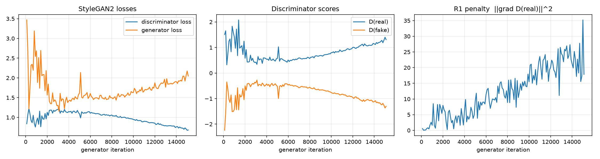 | 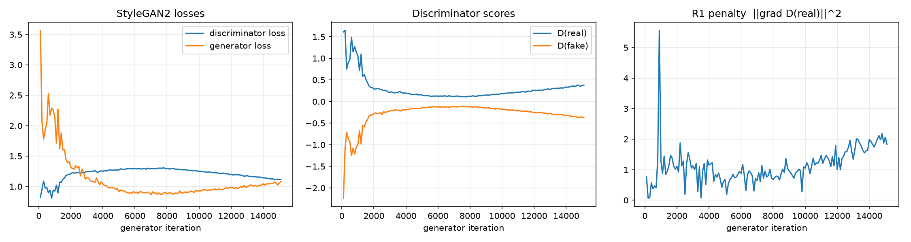 | 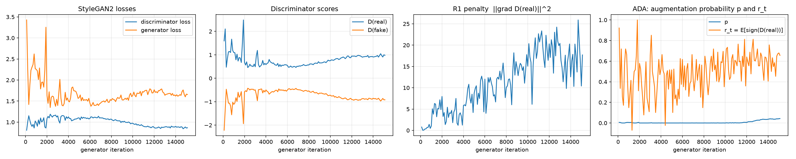 |

### 11.6 Coverage of classes and slice positions

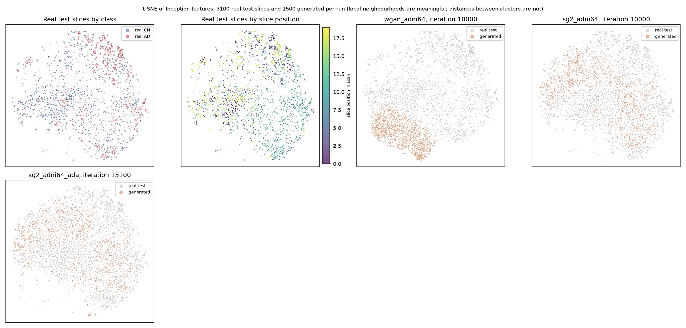

*Joint t-SNE of Inception features: real test slices coloured by class and by slice position, then each model's generated slices over the real slices in grey. Local neighbourhoods are meaningful; distances between clusters are not.*

The real slices are organised mostly by slice position: the lateral ends of each scan's window cluster on the left and the middle positions on the right and bottom. AD slices concentrate in the upper-right region. The baseline's slices form a separate cluster barely overlapping the real data, consistent with its low precision and coverage. Both StyleGAN2 snapshots spread across the map and cover the full range of slice positions, but leave the AD-rich upper-right region largely uncovered.

A 10-nearest-neighbour class vote in Inception space supports this, with a caveat. The features barely separate the classes (real validation slices: 56.4% balanced accuracy; predicted AD share 34.0% against a true 49.7%), so shares are indicative only. Against that 34% reference, generated cohorts look AD-like far less often: baseline 10.7%, StyleGAN2 13.4%, ADA at 15,100 iterations 19.1%. **Unconditional generation under-represents AD-typical anatomy.**

### 11.7 Failure autopsy

[To complete once `autopsy.py` has run: the figure `figures/sg2_adni64_iter010000_autopsy.png`, one uncurated grid, and a diagnosis for each of the five rules (near-copy, least like real, off-manifold, dark, dropped mode).]

### 11.8 Resource profiling

| | WGAN-GP | StyleGAN2 | StyleGAN2 + ADA |
|---|---:|---:|---:|
| Generator parameters | 3,574,656 | 8,386,958 (mapping 2,101,248) | 8,386,958 |
| Discriminator / critic parameters | 2,764,481 | 5,854,337 | 5,854,337 |
| Training time per iteration (batch 64) | 95 ms | 260 ms | 263 ms |
| Training time, 15,100 iterations | 25 min | 67 min | 68 min |
| Peak GPU memory, training | 0.43 GB | 5.6 GB | 5.6 GB |
| Generation time per 1,000 slices | [ms] | [ms] | [ms] |
| Full evaluation (`predict.py`, 7 snapshots, no model comparison) | about 12 min | about 12 min | about 12 min |

All on one NVIDIA A100-PCIE-40GB. The whole project used about [N] A100-hours (from `sacct`), well within the 30 A100-hour estimate in the feasibility review; no single job needed more than 70 minutes.

### 11.9 Acceptance criteria

| Criterion (Section 2) | Result |
|---|---|
| 1. Fidelity: lower FID than the baseline; SSIM > 0.6 | **Met.** FID 13.7 vs 48.4 at 10,000 iterations; median nearest-neighbour SSIM 0.80 (whole) and 0.62 (brain) |
| 2. No copies among 3,100 slices | **Met at the recommended checkpoint** (10,000) and at 15,100 for every run; **not met at 12,500** for default StyleGAN2 and ADA (one slice each) |
| 3. Flag rate and excess no higher than the baseline's at equal or better FID | **Met on excess, not on flag rate.** The flag rate turned out to measure realism as much as memorisation (Section 11.3); the excess, which separates the two, is significantly lower for StyleGAN2 |
| 4. Coverage across both classes and slice positions | **Partly met.** Slice positions are covered; the AD-rich region is under-covered (Section 11.6) |
| 5. One A100, jobs ≤ 12 h, ≤ 24 GPU-hours per configuration | **Met.** About 67 minutes and 5.6 GB per StyleGAN2 run |

### 11.10 Recommendation to the project manager

**Use StyleGAN2, stopped at about 10,000 iterations, and screen every cohort before release.**

- At 10,000 iterations StyleGAN2 has real-level precision and density, 88% of real coverage, no copy-level slices, a training-specific excess of about zero, and a FID within about 2 points of the best snapshot of any run. Training longer buys 1–2 FID points for a small, measurable drift towards training patients; neither a stronger R1 penalty nor ADA (as configured) removed that drift.
- **Release safeguard:** run every generated cohort through the audit (`predict.py`) and drop any slice at or above copy level before sharing. Near-copies are rare (at most one in 3,100 per snapshot) but do occur, so this check is cheap insurance. Do not judge a cohort by its flag rate alone; use the matched-reference excess.
- **Not yet suitable for training or testing AD classifiers.** The unconditional cohort under-represents AD-typical anatomy (Section 11.6), so a dataset built from it would be biased towards CN. A class-conditional generator, evaluated per class with a dedicated AD/CN classifier rather than generic image features, is the necessary next step.
- **Privacy caveat:** the audit barely recognises a patient across visits (Section 7.3), so it cannot rule out a generator reproducing a training patient's anatomy in a new head position. A feature-space identity check would be needed before any release outside the research team.

### 11.11 Limitations and future work

- **Single runs.** Each configuration was trained once, so small differences between StyleGAN2 variants (about 1 FID point) cannot be attributed to the variant. The large effects (StyleGAN2 vs the baseline on fidelity and excess) are well beyond run-to-run noise.
- **Resolution.** All results are at 64 × 64; memorisation behaviour may differ at 128 or 256 px.
- **ADA was not effectively tested,** because its standard trigger never activated (Section 11.5).
- **Evaluation features.** Inception-v3 was trained on colour photographs; it sees upscaled greyscale slices and is nearly blind to AD-specific anatomy.
- **Validation sample size.** The audit threshold rests on 68 validation patients; the matched-reference control on 68 test patients, which is why single-run excess intervals are wide.
- **Future work:** a class-conditional StyleGAN2; fixed-probability augmentation; a feature-space identity audit; repeated runs with different seeds; higher resolutions.

## 12. Artificial Intelligence Usage Disclosure

This disclosure follows the UQ Library *Guide to acknowledging and referencing AI*, which asks for the AI tool, how it was used, the prompts, the part of the work affected, and the date. A verification column is added as required by the COMP3710 report specification (Section 6.1). The log is updated as the project progresses.

### 12.1 Tools used

| Tool | Provider | Access |
|---|---|---|
| Claude Opus 5.5 | Anthropic | claude.ai web interface (project workspace) |

### 12.2 Usage log

| Date | AI tool | How it was used | Prompt(s) (summarised or quoted) | Part of the work | How I verified it |
|---|---|---|---|---|---|
| 28/09/2026 | Claude Opus 5.5 | **Planned / brainstormed:** compared the Hard-difficulty projects against my previous lab work; I chose StyleGAN2 on ADNI | "Give me my best options, hard difficulty only…"; "how about style GAN? … would it connect with what i've done in the assessments?" | Project choice; Sections 1 and 6 | Checked each option's difficulty band, dataset, and targets against Section 2 of the report specification |
| 28/09/2026 | Claude Opus 5.5 | **Instructions:** step-by-step guidance for forking the repository, the folder skeleton, `.gitignore`, and GitHub SSH access from Rangpur | "maybe we should fork the repo first and setup the vs code environment first?"; "lets do the ssh stuff now with rangpur" | Repository structure, `.gitignore`, Git workflow | Confirmed the `topic-recognition` branch and project folder on GitHub; `ssh -T git@github.com` authenticated successfully; verified GitHub's host key fingerprint against GitHub's published value |
| 28/09/2026 | Claude Opus 5.5 | **Generated code:** shell and Python one-off commands to explore the ADNI folder structure, filename convention, metadata JSON, and patient-level overlap | Requests to inspect the ADNI dataset on Rangpur | Sections 3 and 4 (dataset structure, Discoveries 1–7) | Ran every command myself on Rangpur and reviewed the raw output; checked internal consistency (e.g. scans per patient sums to 680 patients and 1,526 scans) |
| 28/09/2026 | Claude Opus 5.5 | **Brainstormed / planned:** proposed the patient-level re-split and the memorisation threshold calibrated from repeat visits of the same patient (distance ladder); I adopted both | "For the design, I like the measure of how similar two scans of the same person across visits can be used as a principled memorisation threshold, can we include that in the design too?" | Sections 5.2 and 7 | Reasoned through each design choice against the leakage evidence in Section 4; implementation and validation still to come |
| 28/09/2026 | Claude Opus 5.5 | **Generated code:** wrote `data_audit.py` (dataset checks and README figures) | "lets update the readme, have to document the preprocessing steps … could be good to have some graphs generated at this stage too" | `data_audit.py`; `figures/`; Section 8 | Ran it on the full dataset on Rangpur; its statistics matched my earlier independent command outputs (e.g. 216 overlapping patients, 1,526 scans); inspected the generated figures |
| 28/09/2026 | Claude Opus 5.5 | **Drafted / edited:** drafted README Sections 3–8 from my audit results, then updated them with the full audit output (including Discovery 9) | Same as above, plus pasting the `data_audit.py` output | README Sections 3–8 | Checked every number in the README against the Rangpur output |
| 28/09/2026 | Claude Opus 5.5 | **Drafted:** this disclosure table, following UQ Library guidance located via web search | "can you add an AI usage referencing table to the readme in accordance with uq guidelines?? include the date - 28/09/2026" | Section 12 | Checked the required fields against the UQ Library guide linked below |
| 28/09/2026 | Claude Opus 5.5 | **Edited:** changed the AI reference in 12.4 to UQ's general APA format with the tool's web address, and added it to the reference list | "yes add the tool's web address to those references" | Sections 12.4 and 13 | Checked the format against the APA 7th "General AI references" example in the UQ Library guide |
| 28/09/2026 | Claude Opus 5.5 | **Planned:** ordered the next stages (data pipeline → threshold calibration → WGAN-GP baseline → feasibility review → StyleGAN2) | "ok all done, git is up to date. Where to next?" | Project plan; Section 2 (feasibility review) | Checked the plan against the feasibility check-off requirements in Section 3 of the report specification |
| 28/09/2026 | Claude Opus 5.5 | **Generated code:** wrote `dataset.py` (slice indexing, patient-level stratified split, padding/resizing, cached preloading, OASIS verification loader, smoke test) | "yes" (in response to the proposal to write `dataset.py` with the index, patient-level split, and preloading) | `dataset.py`; Sections 5.1 and 5.2 | Indexing and split logic were tested on synthetic data (correct 544/68/68 patient split, deterministic across runs). Ran the smoke test on Rangpur: the leakage assertion passed, the split table matched the designed patient counts (544/68/68), and the real-image grids in `figures/dataset_batch_check.png` and `figures/oasis_batch_check.png` showed correctly preprocessed brain slices |
| 05/10/2026 | Claude Opus 5.5 | **Generated code / analysed:** proposed cropping to the brain region and wrote the brain-extent measurement and crop support in `data_audit.py` and `dataset.py` | "yes" (in response to the proposal to crop to the brain region) | `data_audit.py`; `dataset.py` (`ADNI_CROP`); Discovery 10 | Ran the measurement on Rangpur. Claude's visual estimate of brain size from the batch grid (about 40% of the frame) was wrong; the measurement showed about 65% and a full-frame crop, so I rejected cropping based on the evidence |
| 05/10/2026 | Claude Opus 5.5 | **Generated code:** one-off diagnostic scripts to locate outlier slices, per-scan intensity, edge-touching scans, and the second-darkest scan, plus `scp` commands to retrieve figures | Requests to run and retrieve the diagnostics (e.g. "give me the scp cmds") | Discoveries 11–12 | Inspected every diagnostic figure myself: two scans are corrupted, three edge-touching scans are anatomically normal |
| 05/10/2026 | Claude Opus 5.5 | **Generated code:** relative-intensity exclusion rule applied after the patient split in `dataset.py`; folded the diagnostics into `data_audit.py` | Continuation of the outlier investigation, after I uploaded the figures and output | `dataset.py`; `data_audit.py`; Section 5.1 | Full audit on Rangpur flagged exactly the 2 corrupted scans; smoke test passed the leakage check, removed 2 scans (40 slices) from train only, and left val and test unchanged |
| 05/10/2026 | Claude Opus 5.5 | **Drafted:** README updates for Discoveries 10–12 and Sections 3.4, 5.1, 5.2, 6, and 8 | Pasting the audit and smoke-test output | README Sections 3–6, 8 | Checked every number against the Rangpur output |
| 05/10/2026 | Claude Opus 5.5 | **Generated code:** wrote `audit.py` part 1 (batched GPU SSIM, near-duplicate, same-person and different-person rungs, per-class thresholds) and the Slurm script `audit.sh` | "let me give you access to the repo … Read dataset.py from my fork" | `audit.py`, `audit.sh`; Section 7 | Claude checked its SSIM against scikit-image (agreement within 5 × 10⁻⁶) and the chunked search against brute force on synthetic data; I reviewed the code and ran it on ADNI on Rangpur (job 632476) |
| 05/10/2026 | Claude Opus 5.5 | **Debugged:** diagnosed why the job sat in `PartitionConfig`. Claude's first `audit.sh` copied `--mem` from the course guide and omitted `--account`, and its `source activate` line received the script's arguments | Pasted `squeue`, `scontrol show partition`, `scontrol show job` and `sacctmgr` output | `audit.sh`; Section 7.5 | Confirmed with `scontrol` (partition memory 10M in total, `AllowAccounts=comp3710`, job charged to my personal account) and `sacctmgr`; the corrected job ran with an empty error log |
| 06/10/2026 | Claude Opus 5.5 | **Analysed / generated code:** Claude pointed out that the first run's same-person threshold (~1.0) was invalid (the design it had proposed on 28/09), hypothesised duplicate acquisitions, and wrote a visit-pair diagnostic dating each scan from its metadata path | Pasted the first `audit.py` output and the structure of a metadata `raw` path (patient ID masked) | `audit.py`; Discoveries 13–14 | Ran the diagnostic on Rangpur (job 634430): near-identical pairs occur only on the same day, and different-day visits are misaligned (median best-match offset 4 slices) |
| 06/10/2026 | Claude Opus 5.5 | **Generated code:** restructured the audit around validation-calibrated stranger thresholds, with same-session and different-day pairs as reference rungs. I asked whether this was worthwhile before agreeing. Committed as `0c93c41`, which by mistake reuses the previous commit's message | "do you think it is worthwhile restructuring the threshold? if that will give us better findings and a better stylegan ultimately, i think we should." | `audit.py`; Section 7 | Claude tested it on synthetic patients with planted copies; I ran it on ADNI (job 634470): test false-flag rate 0.3–0.9% against the nominal 1%, and at least 99.2% of near-duplicates flagged |
| 06/10/2026 | Claude Opus 5.5 | **Drafted:** README updates for Discoveries 5, 8, 13 and 14 and Sections 6 and 7, plus these log rows | "yes, lets do it" (after uploading the audit figure) | README Sections 4, 6, 7 and 12 | Checked every number against the output of jobs 632476, 634430 and 634470 |
| 18/10/2026 | Claude Opus 5.5 | **Generated code:** ported my Lab 2 WGAN-GP into `modules.py` (stages scale with resolution) and wrote `train.py`/`train.sh` (iteration-based training, logging, versioned snapshots, resume) | "yes lets do it" and "its in task3_gan https://github.com/cocoagoodwin101-ui/comp3710-lab2-pattern-recognition.git" | `modules.py`, `train.py`, `train.sh`; Section 11.1 | Claude loaded Lab 2 weights into the port (identical outputs). I trained it on OASIS on Rangpur and compared losses and samples with my Lab 2 results before training on ADNI |
| 18/10/2026 | Claude Opus 5.5 | **Generated code:** `predict.py` (generated-sample audit), then neighbour-concentration and copy-level checks, then the matched-reference test. Claude's first concentration comparison turned out to be confounded (test slices come in correlated runs of 20) | "yes" (to each proposed check) | `predict.py`; Section 11.3 | Claude tested each check with planted copies on synthetic data; I ran every version on Rangpur. I accepted Claude's correction that the concentration comparison could not measure diversity |
| 22/10/2026 | Claude Opus 5.5 | **Generated code / analysed:** paired-by-subset excess with a patient-level bootstrap. The result showed Claude's earlier claim ("clearly present from about 10,000 iterations") overstated the baseline's drift | "robustness refinement first" | `predict.py`; Section 11.3 | Ran on Rangpur (job 685336); the 95% intervals include zero, and the README reports the drift as consistent but not significant |
| 22/10/2026 | Claude Opus 5.5 | **Drafted:** the one-page feasibility review and a check-off study sheet; Claude revised the review when I asked whether it was sufficient (added aim and plan, made criterion 3 comparative) | "you sure that one-page feasibility review is sufficient??" | Section 2 | Checked against the four required parts in Section 3 of the specification; presented it at the check-off |
| 23/10/2026 | Claude Opus 5.5 | **Generated code:** FID and improved precision/recall with a real-vs-real reference; later density/coverage and the trade-off figure | "yes, and also, are we getting the stylegan done now (have we finished the baseline??)" | `predict.py`; Sections 11.2 and 11.4 | Claude checked the metrics on distributions with known answers (identical, shifted, half the modes dropped, diffuse outliers); I ran them on all snapshots on Rangpur |
| 23/10/2026 | Claude Opus 5.5 | **Generated code:** StyleGAN2 generator, discriminator and losses in `modules.py`; StyleGAN2 training in `train.py`; snapshot support in `predict.py` | "yes, committed already, lets move forward with that order" | `modules.py`, `train.py`, `predict.py`; Section 1 | Claude checked the modulated convolution against a per-sample reference, demodulation variance, shapes at 64–256 px and gradients. I verified the implementation by training on OASIS and comparing with the baseline before ADNI |
| 24/10/2026 | Claude Opus 5.5 | **Generated code / analysed:** direct model comparison of excess and single-snapshot evaluation; interpreted StyleGAN2's high flag rate as a realism confound | "yes" | `predict.py`; Section 11.3 | Claude tested the comparison with a planted difference; on Rangpur (job 692112) StyleGAN2's excess was significantly below the baseline's from 7,500 iterations |
| 24/10/2026 | Claude Opus 5.5 | **Generated code / planned:** adaptive discriminator augmentation for greyscale MRI and the `--ada` option; proposed the stronger-R1 run as a test of its discriminator-sharpening hypothesis, which the run then rejected | "yes, if you recommend that, after we finish that how close are we to finishing?" | `modules.py`, `train.py`; Section 11.5 | Claude unit-tested augmentation and the p update; I ran both experiments. The stronger-R1 result contradicted Claude's proposed mechanism, and the README reports the hypothesis as rejected |
| 25/10/2026 | Claude Opus 5.5 | **Generated code:** `embed.py` (joint t-SNE and a class vote) and `autopsy.py` (rule-selected failure cases and uncurated grids) | "yes" | `embed.py`, `autopsy.py`; Sections 11.6 and 11.7 | Tested on synthetic data; ran on Rangpur and inspected every figure myself |
| 25/10/2026 | Claude Opus 5.5 | **Drafted:** README Sections 1, 6, 9, 10 and 11 and these log rows | "yes" (to drafting the README results) | README | Checked every number against the Rangpur job outputs |

### 12.3 Verification approach

AI-generated commands and code were never trusted on their own output alone. Every statistic reported here comes from commands I ran on Rangpur, and counts were cross-checked between independent methods (one-off shell commands and `data_audit.py`). Design suggestions were adopted only after I checked them against the dataset evidence. I take full responsibility for all code, analysis, and claims in this project.

### 12.4 Reference (APA 7th)

Anthropic. (2026). *Claude* [Large language model]. https://claude.ai

Guidance followed: The University of Queensland Library. *Guide to acknowledging and referencing AI.* https://guides.library.uq.edu.au/referencing/acknowledging-and-referencing-ai

## 13. References

- T. Karras, S. Laine, and T. Aila, "A style-based generator architecture for generative adversarial networks," CVPR, 2019.
- T. Karras et al., "Analyzing and improving the image quality of StyleGAN," CVPR, 2020.
- S. Liu, S. Chandra, et al., "Style-based generative models for medical neuroimaging," IEEE Transactions on Medical Imaging, 2023.
- Alzheimer's Disease Neuroimaging Initiative (ADNI), http://adni.loni.usc.edu
- Anthropic. (2026). *Claude* [Large language model]. https://claude.ai
- Z. Wang, A. C. Bovik, H. R. Sheikh, and E. P. Simoncelli, "Image quality assessment: from error visibility to structural similarity," IEEE Transactions on Image Processing, vol. 13, no. 4, pp. 600–612, 2004.
- I. Gulrajani, F. Ahmed, M. Arjovsky, V. Dumoulin, and A. Courville, "Improved training of Wasserstein GANs," in Proc. NeurIPS, 2017.
- T. Karras, M. Aittala, J. Hellsten, S. Laine, J. Lehtinen, and T. Aila, "Training generative adversarial networks with limited data," in Proc. NeurIPS, 2020.